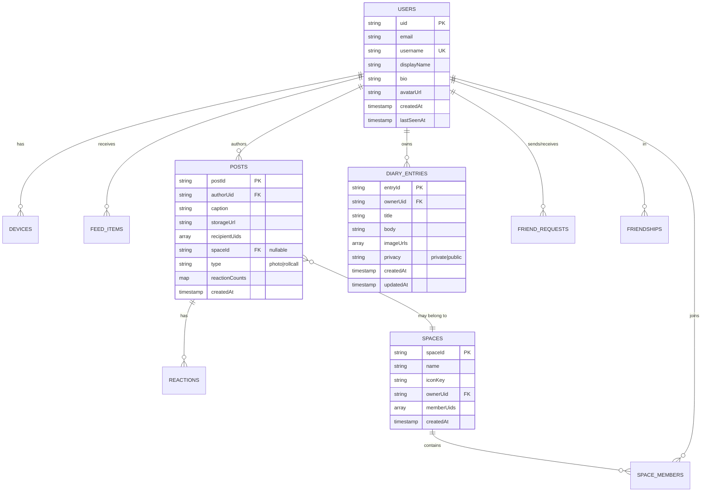

# Meep — Data Model (Firestore + Storage)

Schema đầy đủ cho Tier 0 + Tier 0+. Đây là **single source of truth** cho data layer. Khi cần update schema, edit file này TRƯỚC, sau đó migration code.

> **Conventions:** Field names `camelCase`, collections `lower_snake_case` plural, document IDs `snake_case` hoặc auto-generated.

## Collections overview



## Tier 0 + 0+ collections detail

### `users/{uid}`

**Mục đích:** User profile. Source of truth cho displayName, username, avatar.

**Schema:**

| Field | Type | Required | Notes |
|---|---|---|---|
| `uid` | string | yes | Doc ID = Firebase Auth uid |
| `email` | string | yes | Unique, lowercase |
| `username` | string | yes | Unique, 3-20 chars, regex `^[a-z][a-z0-9_]{2,19}$`, lowercase |
| `displayName` | string | yes | "Họ Tên" combined, 2-50 chars |
| `firstName` | string | yes | "Họ" |
| `lastName` | string | yes | "Tên" |
| `bio` | string | no | 0-150 chars |
| `avatarUrl` | string | no | Storage public URL |
| `phoneHash` | string | no | SHA-256(phone + salt), cho friend discovery (defer M2) |
| `emailVerified` | bool | yes | Synced từ Firebase Auth |
| `createdAt` | timestamp | yes | Server timestamp |
| `lastSeenAt` | timestamp | yes | Update khi user online |
| `fcmTokens` | array<string> | no | List active FCM tokens (denormalized cho fan-out perf) |

**Subcollections:**
- `users/{uid}/devices/{deviceId}` — FCM token + device metadata
- `users/{uid}/feed_items/{postId}` — denormalized feed (write từ Cloud Function fan-out)

**Indexes:**
- Single: `username` ASC (uniqueness check)
- Single: `phoneHash` ASC (friend discovery)
- Composite: `(lastSeenAt DESC, createdAt DESC)` — active users query

**Hot queries:**
```typescript
// Get user by uid
firestore.doc(`users/${uid}`).get()

// Search by username
firestore.collection('users').where('username', '==', query).limit(10).get()

// Active users last 7 days (for RollCall)
firestore.collection('users')
  .where('lastSeenAt', '>=', sevenDaysAgo)
  .orderBy('lastSeenAt', 'desc')
  .get()
```

---

### `users/{uid}/devices/{deviceId}`

**Mục đích:** Track FCM tokens per device cho push notifications.

**Schema:**

| Field | Type | Required | Notes |
|---|---|---|---|
| `deviceId` | string | yes | Doc ID = Android Advertising ID hoặc UUID |
| `fcmToken` | string | yes | Latest FCM token |
| `platform` | string | yes | `'android'` (MVP), `'ios'` defer |
| `appVersion` | string | yes | Vd `'1.0.0'` |
| `lastUpdated` | timestamp | yes | Server timestamp |

**Hot queries:**
```typescript
// Get all FCM tokens for user (fan-out push)
firestore.collection(`users/${uid}/devices`).get()
```

---

### `users/{uid}/feed_items/{postId}`

**Mục đích:** **Denormalized feed** cho performance. Cloud Function `onPostCreated` fan-out cho từng recipient. Tránh fan-in query expensive.

**Schema:**

| Field | Type | Required | Notes |
|---|---|---|---|
| `postId` | string | yes | Doc ID = post ID |
| `authorUid` | string | yes | Sender |
| `authorDisplayName` | string | yes | Denormalized cho hiển thị |
| `authorAvatarUrl` | string | no | Denormalized |
| `caption` | string | no | Denormalized |
| `thumbnailUrl` | string | yes | Resized URL (medium) |
| `originalUrl` | string | yes | Storage URL |
| `type` | string | yes | `'photo'` hoặc `'rollcall'` |
| `spaceId` | string | no | Nếu thuộc Space |
| `createdAt` | timestamp | yes | Sync từ post |
| `seenAt` | timestamp | no | Track user đã xem |

**Hot queries:**
```typescript
// Get feed (paginated)
firestore.collection(`users/${uid}/feed_items`)
  .orderBy('createdAt', 'desc')
  .limit(20)
  .get()

// Filter by space
firestore.collection(`users/${uid}/feed_items`)
  .where('spaceId', '==', spaceId)
  .orderBy('createdAt', 'desc')
  .limit(20)
  .get()
```

**Trade-off:** Denormalize tốn storage (4 bạn × 1 ảnh = 4 docs feed_items) nhưng tăng read perf 100x. OK cho scale 100-500 users.

---

### `friend_requests/{requestId}`

**Mục đích:** Pending friend invitations.

**Schema:**

| Field | Type | Required | Notes |
|---|---|---|---|
| `requestId` | string | yes | Doc ID = `${senderUid}_${receiverUid}` |
| `senderUid` | string | yes | |
| `receiverUid` | string | yes | |
| `senderDisplayName` | string | yes | Denormalized |
| `senderAvatarUrl` | string | no | Denormalized |
| `status` | string | yes | `'pending'` (only — accepted/declined → delete doc) |
| `createdAt` | timestamp | yes | |

**Hot queries:**
```typescript
// Get incoming requests
firestore.collection('friend_requests')
  .where('receiverUid', '==', uid)
  .where('status', '==', 'pending')
  .orderBy('createdAt', 'desc')
  .get()

// Get outgoing requests
firestore.collection('friend_requests')
  .where('senderUid', '==', uid)
  .get()
```

**Lifecycle:**
- Sender create → doc với `status: 'pending'`
- Receiver accept → Cloud Function: tạo `friendships/{sortedPair}` + delete request doc
- Receiver decline → delete request doc
- Sender cancel → delete request doc

---

### `friendships/{sortedPair}`

**Mục đích:** Bidirectional friend graph. **Source of truth** cho "who can see whose photos".

**Schema:**

| Field | Type | Required | Notes |
|---|---|---|---|
| `sortedPair` | string | yes | Doc ID = `${minUid}_${maxUid}` (alphabetical sort 2 uids) |
| `uidA` | string | yes | min(uid1, uid2) |
| `uidB` | string | yes | max(uid1, uid2) |
| `createdAt` | timestamp | yes | Khi accept |

**Hot queries:**
```typescript
// Check if 2 users are friends
const sortedPair = [uid1, uid2].sort().join('_')
firestore.doc(`friendships/${sortedPair}`).get()

// Get all friends of user
firestore.collection('friendships')
  .where('uidA', '==', uid)
  .get()
// Plus
firestore.collection('friendships')
  .where('uidB', '==', uid)
  .get()
// Merge results.
```

**Index:** Single field `uidA`, `uidB`.

**Note:** Có thể optimize bằng cách dùng array `[uidA, uidB]` + `array-contains` nhưng pattern này phổ biến hơn.

---

### `posts/{postId}`

**Mục đích:** Photo post metadata. Storage URL link tới actual image.

**Schema:**

| Field | Type | Required | Notes |
|---|---|---|---|
| `postId` | string | yes | Doc ID = Firestore auto-id |
| `authorUid` | string | yes | |
| `caption` | string | no | 0-200 chars |
| `originalUrl` | string | yes | Storage path full size |
| `thumbnailUrl` | string | yes | Resized 1080p (set sau khi Cloud Function resize) |
| `recipientUids` | array<string> | yes | Friends nhận (subset of friend graph) |
| `spaceId` | string | no | Nếu post vào Space, recipientUids = members |
| `type` | string | yes | `'photo'` hoặc `'rollcall'` |
| `reactionCounts` | map<string, number> | no | Denormalized vd `{ '❤️': 3, '🔥': 1 }` |
| `createdAt` | timestamp | yes | Server timestamp |
| `metadata` | map | no | Optional: location (anonymized), device, etc. (defer) |

**Subcollections:**
- `posts/{postId}/reactions/{reactionId}` — reactions (xem riêng)

**Indexes:**
- Composite: `(authorUid, createdAt DESC)` — profile grid
- Composite: `(type, createdAt DESC)` — RollCall feed
- Single: `recipientUids` ARRAY_CONTAINS — feed query (alternative cho denormalized feed_items)

**Hot queries:**
```typescript
// Get author's posts (profile grid)
firestore.collection('posts')
  .where('authorUid', '==', uid)
  .orderBy('createdAt', 'desc')
  .limit(20)
  .get()

// Get RollCall posts in feed
firestore.collection('posts')
  .where('type', '==', 'rollcall')
  .where('recipientUids', 'array-contains', currentUid)
  .orderBy('createdAt', 'desc')
  .limit(20)
  .get()
```

---

### `posts/{postId}/reactions/{reactionId}`

**Mục đích:** Emoji reactions per post. Schema khác giữa Tier 0 (single) vs Tier 0+ (multi cho RollCall).

**Schema (single emoji react — Tier 0):**

| Field | Type | Required | Notes |
|---|---|---|---|
| `reactionId` | string | yes | Doc ID = `{userUid}` (1 user 1 reaction per post) |
| `userUid` | string | yes | |
| `emoji` | string | yes | Vd `'❤️'`, `'🔥'`, `'😂'`, `'😍'` |
| `createdAt` | timestamp | yes | |

**Schema (multi emoji react — Tier 0+ RollCall):**

| Field | Type | Required | Notes |
|---|---|---|---|
| `reactionId` | string | yes | Doc ID = `{userUid}_{emoji}` (1 user N reactions per post) |
| `userUid` | string | yes | |
| `emoji` | string | yes | |
| `createdAt` | timestamp | yes | |

**Discriminator:** Cloud Function check `posts/{postId}.type` — nếu `rollcall` → cho phép multi (key = `{userUid}_{emoji}`); nếu `photo` → key = `{userUid}` (override on re-react).

**Hot queries:**
```typescript
// Get all reactions for post
firestore.collection(`posts/${postId}/reactions`).get()

// Get my reaction(s) for post
firestore.collection(`posts/${postId}/reactions`)
  .where('userUid', '==', currentUid)
  .get()
```

---

### `diary_entries/{entryId}`

**Mục đích:** Diary entries (Tier 0+ #9). Text + 1-3 ảnh attach. Private hoặc public.

**Schema:**

| Field | Type | Required | Notes |
|---|---|---|---|
| `entryId` | string | yes | Doc ID = Firestore auto-id |
| `ownerUid` | string | yes | |
| `title` | string | yes | 1-100 chars |
| `body` | string | no | 0-5000 chars (plain text, không rich) |
| `imageUrls` | array<string> | no | 0-3 Storage URLs |
| `imageThumbnails` | array<string> | no | Resized thumbnails (set qua Cloud Function) |
| `privacy` | string | yes | `'private'` (default) hoặc `'public'` |
| `createdAt` | timestamp | yes | |
| `updatedAt` | timestamp | yes | |

**Indexes:**
- Composite: `(ownerUid, createdAt DESC)` — list owned entries
- Composite: `(ownerUid, privacy, createdAt DESC)` — public entries hiện trên profile

**Hot queries:**
```typescript
// List own entries
firestore.collection('diary_entries')
  .where('ownerUid', '==', uid)
  .orderBy('createdAt', 'desc')
  .get()

// List friend's public entries (visible on their profile)
firestore.collection('diary_entries')
  .where('ownerUid', '==', friendUid)
  .where('privacy', '==', 'public')
  .orderBy('createdAt', 'desc')
  .get()
```

---

### `spaces/{spaceId}`

**Mục đích:** Group definition (Tier 0+ #10).

**Schema:**

| Field | Type | Required | Notes |
|---|---|---|---|
| `spaceId` | string | yes | Doc ID = Firestore auto-id |
| `name` | string | yes | 1-30 chars vd "Bạn thân", "Family" |
| `iconKey` | string | yes | Preset icon key vd `'heart'`, `'star'`, `'family'`, `'travel'` |
| `ownerUid` | string | yes | Creator (KHÔNG có admin role MVP — mọi member equal) |
| `memberUids` | array<string> | yes | List uids tất cả members (denormalized) |
| `createdAt` | timestamp | yes | |

**Subcollections:**
- `spaces/{spaceId}/members/{uid}` — member metadata (joinedAt) — **optional**, có thể skip nếu denormalize trong `memberUids` đủ

**Indexes:**
- Single: `memberUids` ARRAY_CONTAINS — list spaces của user
- Composite: `(memberUids ARRAY_CONTAINS, createdAt DESC)` — sorted spaces

**Hot queries:**
```typescript
// List user's spaces
firestore.collection('spaces')
  .where('memberUids', 'array-contains', uid)
  .orderBy('createdAt', 'desc')
  .get()

// Check if user is member
firestore.collection('spaces')
  .where('memberUids', 'array-contains', uid)
  .where('spaceId', '==', spaceId)
  .get()
```

**Note:** `memberUids` array có limit 5000 (Firestore document size limit ~1MB). Cho MVP scale 100-500 users / space đủ. Post-capstone scale hơn → migrate sang subcollection.

---

## Tier 1 collections (stretch — defer trừ khi unlock)

### `chats/{chatId}` (Tier 1 — Chat 1-1)

| Field | Type | Notes |
|---|---|---|
| `chatId` | string | Doc ID = `${minUid}_${maxUid}` (1-1 only) |
| `participantUids` | array<string> | [uidA, uidB] |
| `anchorPostId` | string | Photo gốc trigger thread |
| `lastMessage` | map | `{ text, senderUid, timestamp }` denormalized |
| `unreadCount` | map<string, number> | `{ uidA: 0, uidB: 3 }` |
| `createdAt` | timestamp | |

### `chats/{chatId}/messages/{messageId}` (Tier 1)

| Field | Type | Notes |
|---|---|---|
| `messageId` | string | Auto-id |
| `senderUid` | string | |
| `text` | string | 1-500 chars |
| `createdAt` | timestamp | |
| `readBy` | array<string> | uids đã read |

---

## Cloud Storage paths

| Path | Mục đích | Limit | Public read? |
|---|---|---|---|
| `posts/{authorUid}/{postId}/original.jpg` | Photo full size | 10MB, image MIME | Friends only (rule check) |
| `posts/{authorUid}/{postId}/medium.jpg` | Resized 1080p (Cloud Function) | — | Friends only |
| `posts/{authorUid}/{postId}/thumbnail.jpg` | 256x256 thumbnail | — | Friends only |
| `avatars/{uid}/{filename}.jpg` | User avatar | 2MB | Public read (anyone với link) |
| `diary/{ownerUid}/{entryId}/{filename}.jpg` | Diary attached image | 10MB | Owner only nếu private; friends nếu public |

**Storage rules summary:** Xem [`security-model.md`](security-model.md).

## Migration strategy (post-capstone)

Nếu schema cần thay đổi sau MVP:

1. **Backwards-compatible adds:** thêm field optional → OK, không cần migration
2. **Renames / breaking:** Cloud Function migration script + backup trước
3. **Document deletion (account delete):** Cloud Function cascade — defer Tier 2

ADR sẽ ghi mỗi schema breaking change.

## Liên quan

- **API endpoints:** [`api-catalog.md`](api-catalog.md)
- **Security rules:** [`security-model.md`](security-model.md), `firebase/firestore.rules`, `firebase/storage.rules`
- **Firestore rules conventions:** `.windsurf/rules/23-firestore-rules.md`
- **Indexes config:** `firebase/firestore.indexes.json`
