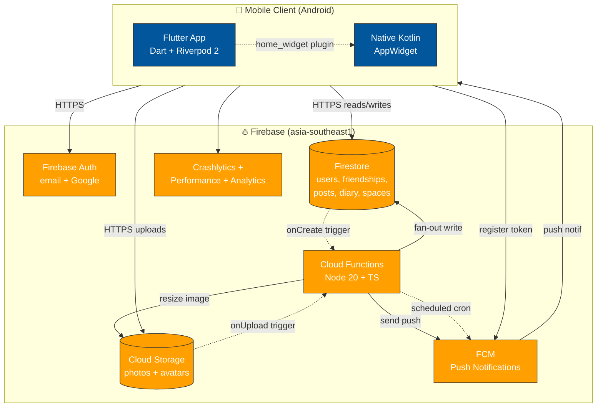

# Meep — System Architecture Overview

High-level architecture cho Meep MVP. Stack chi tiết: ADR-0001. Tech stack table: `.windsurf/rules/10-project-context.md` §"Decisions already made".

## Architecture diagram (high-level)



## Component breakdown

### 1. Flutter App (`apps/mobile/`)

**Stack:** Flutter 3.41 + Dart 3.x + Riverpod 2 (code-gen) + freezed + json_serializable.

**Layering:** Per `.windsurf/rules/21-flutter-rules.md`:

```
apps/mobile/lib/
├── main.dart                       # ProviderScope entry
├── core/
│   ├── theme/                     # Material 3 theme + design tokens
│   ├── error/                     # AppError sealed hierarchy
│   ├── routing/                   # go_router config + auth guard
│   └── di/                        # dependency injection
├── features/
│   ├── auth/
│   │   ├── data/                  # AuthRepository (Firebase Auth wrapping)
│   │   ├── application/           # Riverpod controllers
│   │   └── presentation/          # Screens + widgets (FE-bridge owns)
│   ├── friends/
│   ├── camera/
│   ├── feed/
│   ├── post/
│   ├── reaction/
│   ├── notification/
│   ├── widget_bridge/             # home_widget plugin wrap
│   ├── diary/
│   ├── space/
│   ├── rollcall/
│   └── profile/
└── shared/
    └── widgets/                   # Reusable widgets (≥3 features dùng)
```

**Routing:** `go_router` 14.x + auth guard. Routes: `/intro`, `/signup/:step`, `/login`, `/home`, `/profile/:uid`, `/post/:postId`, `/diary`, `/space/:spaceId`, `/settings`.

### 2. Native Android Widget (`apps/mobile/android/.../kotlin/`)

**Stack:** Kotlin + AppWidgetProvider API + Glance (optional Jetpack Compose for widgets).

**Components:**
- `MeepAppWidgetProvider.kt` — extends AppWidgetProvider
- Widget layout XML (`res/layout/widget_layout.xml`)
- Widget metadata (`res/xml/widget_info.xml`) — size, update interval, preview

**Communication:** `home_widget` Flutter plugin bridges Dart ↔ Kotlin. Dart writes data (latest post URL + caption), Kotlin reads + renders widget.

**Update trigger:** FCM data message (silent push) → app receives → `home_widget.updateWidget()` → AppWidget redraw.

### 3. Firebase (region: asia-southeast1)

#### 3a. Firebase Auth
- Providers: email/password, Google Sign-In
- Token: Firebase ID token (JWT, 1h expire, auto-refresh)
- Custom claims: chưa cần (defer Phase 2)

#### 3b. Firestore (NoSQL document DB)

**Collections (Tier 0 + 0+):**
- `users` — profile data
- `friendships` — bidirectional friend graph
- `friend_requests` — pending invites
- `posts` — photo metadata + recipients
- `reactions` — emoji reactions
- `diary_entries` — Diary entries
- `spaces` — group definitions
- `space_members` — membership (subcollection của spaces)
- `chats` (Tier 1) — chat threads
- `messages` (Tier 1) — chat messages

Schema chi tiết: [`data-model.md`](data-model.md).

**Indexes:** `firestore.indexes.json`. Composite indexes cho hot queries (feed, friend list).

#### 3c. Cloud Storage

**Paths:**
- `posts/{uid}/{postId}/{filename}.jpg` — photo posts
- `avatars/{uid}/{filename}.jpg` — user avatars
- `diary/{uid}/{entryId}/{filename}.jpg` — diary attached images

**Limits:** 10MB / file, image MIME only. Enforce qua Storage rules.

#### 3d. Firebase Cloud Messaging (FCM)

**Channels:**
- `new_photo` — ảnh mới
- `new_reaction` — reaction nhận
- `rollcall_weekly` — RollCall weekly trigger
- `widget_update` — silent data message (no UI notification, chỉ trigger widget)

**Token storage:** `users/{uid}/devices/{deviceId}` subcollection.

#### 3e. Cloud Functions (Node 20 + TypeScript)

**Triggers:**
- `onPostCreated` — Firestore trigger sau khi post được tạo:
  - Resize ảnh (max 1080p, strip EXIF location)
  - Fan-out: tạo entries trong `users/{recipientUid}/feed_items` cho từng recipient
  - Trigger FCM push notification cho recipients
  - Trigger widget update cho recipients
- `onReactionCreated` — Firestore trigger:
  - Update reaction count denormalized trên post document
  - Trigger FCM push notification cho post author
- `onFriendRequestAccepted` — trigger FCM cho cả 2 user
- `rollcallScheduler` — scheduled (cron) Sunday 8pm Vietnam:
  - Bulk send FCM "RollCall" cho all active users
- `findFriendsByPhone` — callable HTTPS (Tier 0 onboarding, may defer M2):
  - Input: phone hashes
  - Output: matched user uids

Detail: [`api-catalog.md`](api-catalog.md).

#### 3f. Crashlytics + Performance + Analytics

- Crashlytics: crash + non-fatal error reporting
- Performance Monitoring: app cold start, network latency, screen render time
- Analytics: event tracking (signup, post, react, widget_tap)

## Data flow — Critical paths

### CP-1: User signup

```
1. User input email + password (5-screen flow)
2. Flutter → Firebase Auth `createUserWithEmailAndPassword`
3. Firebase Auth → return user (uid)
4. Flutter → Firestore write `users/{uid}` document (displayName, username, bio, createdAt)
5. Flutter → register FCM token → write `users/{uid}/devices/{deviceId}`
6. Flutter → navigate /home
```

### CP-2: Post photo (share)

```
1. User chụp ảnh (Flutter camera plugin)
2. User chọn recipients (all friends / specific / Space)
3. Flutter → Cloud Storage upload `posts/{uid}/{postId}/original.jpg`
4. Flutter → Firestore write `posts/{postId}` document
5. Cloud Function `onPostCreated` triggers:
   a. Resize ảnh (max 1080p) → save `posts/{uid}/{postId}/medium.jpg`
   b. Strip EXIF location
   c. Fan-out: write `users/{recipientUid}/feed_items/{postId}` cho từng recipient
   d. Send FCM `new_photo` → recipients
   e. Send FCM `widget_update` → recipients (silent)
6. Recipients nhận push → tap → app deep link → /post/{postId}
7. Recipients home screen → widget refresh với ảnh mới
```

### CP-3: React photo

```
1. User tap emoji bottom of photo
2. Flutter optimistic UI update
3. Flutter → Firestore write `posts/{postId}/reactions/{uid}` document
4. Cloud Function `onReactionCreated` triggers:
   a. Update denormalized count trên `posts/{postId}.reactionCounts`
   b. Send FCM `new_reaction` → post author
5. Author nhận push
```

### CP-4: Widget update

```
1. (Trigger từ CP-2 step 5e) FCM `widget_update` data message → recipient device
2. Flutter receives FCM (background handler)
3. Flutter → fetch latest post từ `users/{uid}/feed_items` (limit 1)
4. Flutter → `home_widget.saveWidgetData('latestPost', json)`
5. Flutter → `home_widget.updateWidget(name: 'MeepAppWidgetProvider')`
6. Native Kotlin AppWidgetProvider.onUpdate → render new image + caption
```

### CP-5: RollCall weekly

```
1. Cron Cloud Function `rollcallScheduler` chạy Sunday 8pm Vietnam (UTC+7)
2. Function query active users (last login <30 days)
3. Function send FCM `rollcall_weekly` cho mỗi user (batch)
4. Users nhận push → tap → /rollcall/post screen
5. User chọn ảnh từ device gallery (filtered last 7 days)
6. Submit → write `posts/{postId}` với `type: 'rollcall'`
7. Multi-emoji react: write `posts/{postId}/reactions/{uid}_{emoji}` (subcollection cho phép multi)
```

## Tech stack summary

| Layer | Tech | Version | Source |
|---|---|---|---|
| Mobile framework | Flutter | 3.41+ | `pubspec.yaml` |
| Language (mobile) | Dart | 3.x | — |
| State management | Riverpod | 2.x (code-gen) | — |
| Routing | go_router | 14.x | — |
| Data classes | freezed + json_serializable | latest | — |
| Camera | `camera` Flutter plugin | latest | — |
| Image cache | `cached_network_image` | latest | — |
| Widget plugin | `home_widget` | latest | — |
| Native Android | Kotlin | 2.x | `apps/mobile/android` |
| Backend functions | Node | 20 LTS | `firebase/functions/package.json` |
| Functions language | TypeScript | strict mode | `firebase/functions/tsconfig.json` |
| Database | Firestore | — | — |
| Storage | Cloud Storage | — | — |
| Auth | Firebase Auth | — | — |
| Push | Firebase Cloud Messaging | — | — |
| Region | asia-southeast1 | (Singapore) | — |
| Tests (Flutter) | flutter_test + fake_cloud_firestore + firebase_auth_mocks | — | — |
| Tests (Functions) | vitest | — | — |

## Deployment topology

### Phase 1 (M1-M2)

```
┌─────────────────────────────────┐
│   1 Firebase project (meep-dev) │
│                                 │
│  - Used for development         │
│  - Used for staging deploy      │
│  - 4 dev test trên cùng project │
└─────────────────────────────────┘
```

### Phase 2 (M3 demo)

```
┌──────────────────┐    ┌───────────────────┐
│ meep-dev         │    │ meep-prod         │
│ (development +   │    │ (demo cho giảng   │
│ staging)         │    │  viên - sạch)     │
└──────────────────┘    └───────────────────┘
       ↑                        ↑
       │                        │
   develop branch           deploy branch
   (auto deploy)            (manual approval)
```

CI workflows: `.github/workflows/develop-staging.yml` + `.github/workflows/deploy-production.yml`.

## Liên quan

- **Tech stack rationale:** [`../adr/0001-firebase-first-backend.md`](../adr/0001-firebase-first-backend.md)
- **Android-only decision:** [`../adr/0002-android-first-defer-ios.md`](../adr/0002-android-first-defer-ios.md)
- **Data model:** [`data-model.md`](data-model.md)
- **API catalog:** [`api-catalog.md`](api-catalog.md)
- **Security model:** [`security-model.md`](security-model.md)
- **Flutter layering rules:** `.windsurf/rules/21-flutter-rules.md`
- **Cloud Functions rules:** `.windsurf/rules/22-functions-rules.md`
- **Firestore rules:** `.windsurf/rules/23-firestore-rules.md`
