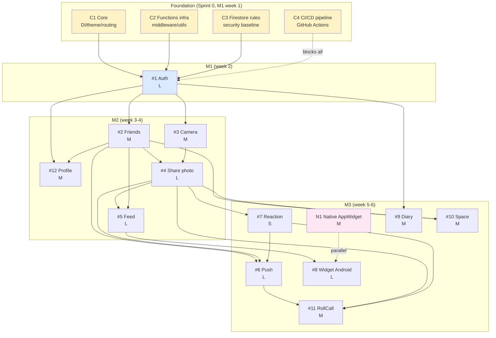

# Module Catalog — Meep

> Single source of truth cho **scope toàn bộ dự án** (17 modules). Tài liệu này dùng cho team kickoff + decision boundary trước khi đi sâu spec từng module.

| Status | Owner | Last update |
|---|---|---|
| 🟢 Active | `ThienPDM` (Leader) | 2026-05-03 |

## 0. Quick navigation

- [§1 Module là gì trong Meep](#1-module-là-gì-trong-meep)
- [§2 Module categories overview](#2-module-categories-overview)
- [§3 Feature modules — Tier 0](#3-feature-modules--tier-0-locket-parity)
- [§4 Feature modules — Tier 0+](#4-feature-modules--tier-0-meep-differentiator)
- [§5 Cross-cutting modules (foundation)](#5-cross-cutting-modules-foundation)
- [§6 Native modules](#6-native-modules)
- [§7 Dependency graph](#7-dependency-graph)
- [§8 Assignment matrix](#8-assignment-matrix)
- [§9 Implementation order (sprint plan)](#9-implementation-order-sprint-plan)
- [§10 Out of scope (defer post-capstone)](#10-out-of-scope-defer-post-capstone)
- [§11 Open decisions](#11-open-decisions-per-module)

---

## 1. Module là gì trong Meep

**Module** = đơn vị code ownership + delivery, gắn 1-1 với 1 folder code path. Đây là khái niệm khác với **feature** (user-facing) và **epic** (GitHub tracking unit).

### Phân biệt

| Khái niệm | Tầm nhìn | Vd | Granularity | Owner |
|---|---|---|---|---|
| **Feature** | User-facing | "Đăng ký + đăng nhập" | 1-2 sentences | Product (Leader) |
| **Module** | Code/dev-facing | `apps/mobile/lib/features/auth/` | 1 folder | Primary dev (per CODEOWNERS) |
| **Epic Issue** | GitHub tracking | Issue #1 [T0] Auth | 1 GitHub issue | Assignee on issue |
| **Sub-issue / Task** | Sprint deliverable | "Tạo màn signup email step 1" | 1 PR ≤200 LOC | 1 dev |

**1 module thường = 1 feature = 1 Epic Issue**, ngoại trừ:
- Cross-cutting modules (C1-C4) không có Epic vì là foundation infra
- Native module N1 song song với Epic #8 (Flutter side)

### Lifecycle 1 module

```
catalog (modules.md, NOW)
   ↓
spec (/spec → docs/specs/YYYY-MM-DD-<module>.md)
   ↓
plan (/plan → tasks/todo-<module>.md, 8-12 sub-tasks)
   ↓
breakdown (sub-issues GitHub, 1 sub-issue = 1 PR ≤200 LOC)
   ↓
implement (4 phases workflow per Epic body)
   ↓
verify + close
```

---

## 2. Module categories overview

| Category | Count | Purpose | Has Epic? |
|---|---|---|---|
| **A. Feature modules — Tier 0** | 8 | Locket parity, must ship M3 | ✅ Yes (#1-8) |
| **B. Feature modules — Tier 0+** | 4 | Meep differentiator, must ship M3 | ✅ Yes (#9-12) |
| **C. Cross-cutting (foundation)** | 4 | Infra/baseline, blocks all features | ❌ No (consider Epic #13-16) |
| **D. Native modules** | 1 | Platform-specific Kotlin | ❌ Parallel với Epic #8 |
| **TOTAL** | **17** | | |

---

## 3. Feature modules — Tier 0 (Locket parity)

### 3.1 Auth — `apps/mobile/lib/features/auth/`

| Field | Value |
|---|---|
| **Epic** | #1 |
| **Tier / Milestone** | T0 / M1 |
| **Lane** | BE-heavy |
| **Owner** | `ThienPDM` (primary) + `KhoaLND` (secondary) |
| **Effort** | **L** (4-5 days, includes 5-screen signup flow + Google OAuth) |

**Purpose:** Foundation auth — signup 5-step flow, login email/Google, auto-login, logout.

**Scope summary:** Signup (email/password/họ tên/username/skip contacts), Login email + Google OAuth, Auto-login persistence, Username unique validation real-time, Logout.

**Out of scope (defer):** Forgot password (Tier 1 stretch), Apple Sign-In (post iOS), Phone OTP, Account deletion.

**Depends on:** `C1 Core`, `C2 Functions infra`, `C3 Firestore rules`.

**Tech refs:**
- Firestore: `users` collection
- Cloud Functions: `validateUsername`
- Figma: `Đăng ký_*.png`, `Đăng nhập_*.png`
- Detail: [features.md §Auth](features.md), [Issue #1](https://github.com/manhthien2005/Meep/issues/1)

---

### 3.2 Friends — `apps/mobile/lib/features/friend/`

| Field | Value |
|---|---|
| **Epic** | #2 |
| **Tier / Milestone** | T0 / M2 |
| **Lane** | BE-heavy |
| **Owner** | `ThienPDM` + `KhoaLND` |
| **Effort** | **M** (3-4 days) |

**Purpose:** Friend graph — invite username/link, accept/decline request, danh sách bạn, unfriend bidirectional.

**Scope summary:** Tìm bạn qua username, invite share link, friend request flow, danh sách bạn + search, unfriend.

**Out of scope:** Friend suggestions, Public/follower model, Block user (Tier 2).

**Depends on:** `Auth (#1)` (cần uid), `C2`, `C3`.

**Tech refs:**
- Firestore: `friend_requests`, `friendships` (pair ID sorted)
- Cloud Functions: `sendFriendRequest`, `acceptFriendRequest`, `declineFriendRequest`
- Issue #2

---

### 3.3 Camera — `apps/mobile/lib/features/camera/`

| Field | Value |
|---|---|
| **Epic** | #3 |
| **Tier / Milestone** | T0 / M2 |
| **Lane** | UI-heavy |
| **Owner** | `ThienPDM` + `NganTNK` + `HanDHG` |
| **Effort** | **M** (2-3 days) |

**Purpose:** Camera basic — capture, flip front/back, caption, save tạm trước upload.

**Scope summary:** Camera preview, capture button, flip cam, caption text 200 chars, image compression < 500KB.

**Out of scope:** Dual camera (multi-cam API), video recording, filters, AR overlays, sticker system (Tier 2).

**Depends on:** `Auth (#1)`, `C1`.

**Tech refs:**
- Plugins: `camera`, `path_provider`, `image`, `permission_handler`
- Figma: `Trang chủ.png` (camera viewfinder)
- Issue #3

---

### 3.4 Share photo — `apps/mobile/lib/features/post/`

| Field | Value |
|---|---|
| **Epic** | #4 |
| **Tier / Milestone** | T0 / M2 |
| **Lane** | BE-heavy |
| **Owner** | `ThienPDM` + `KhoaLND` |
| **Effort** | **L** (4 days, includes upload retry + EXIF strip + fan-out) |

**Purpose:** Upload ảnh Storage, lưu metadata Firestore, trigger fan-out FCM cho friends.

**Scope summary:** Compress + upload Storage, lưu Post metadata, Cloud Function fan-out FCM, retry 3 lần, progress indicator, EXIF strip.

**Out of scope:** Video posts, Multi-image posts, Edit/delete after share (Tier 1).

**Depends on:** `Camera (#3)`, `Friends (#2)`, `C2`, `C3`.

**Tech refs:**
- Firestore: `posts` collection
- Storage: `posts/{uid}/{postId}/{filename}.jpg`
- Cloud Function: `onPostCreated` (Firestore trigger)
- Issue #4

---

### 3.5 Feed — `apps/mobile/lib/features/feed/`

| Field | Value |
|---|---|
| **Epic** | #5 |
| **Tier / Milestone** | T0 / M2 |
| **Lane** | UI-heavy |
| **Owner** | `ThienPDM` + `NganTNK` + `HanDHG` |
| **Effort** | **L** (4 days, includes pagination + cache + skeleton) |

**Purpose:** Vertical list feed bài viết friends, skeleton loader, cache offline, infinite scroll.

**Scope summary:** Vertical timeline, skeleton, cache 20 mới nhất offline, pagination 20/page, pull refresh, empty state.

**Out of scope:** Stories/ephemeral, Public feed (only friends), Algorithmic ranking (chronological only), Comment thread (Tier 1).

**Depends on:** `Share photo (#4)`, `Friends (#2)`, `C1`.

**Tech refs:**
- Plugins: `cached_network_image`, `shared_preferences` hoặc `hive`
- Firestore pagination: `startAfter` cursor
- Issue #5

---

### 3.6 Push notification — `apps/mobile/lib/features/notification/`

| Field | Value |
|---|---|
| **Epic** | #6 |
| **Tier / Milestone** | T0 / M3 |
| **Lane** | BE-heavy |
| **Owner** | `ThienPDM` + `KhoaLND` |
| **Effort** | **L** (4 days, 5 events + 3 states + deeplink routing) |

**Purpose:** FCM Android cho 5 events + deeplink routing khi tap.

**Scope summary:** FCM token register, 5 events (friend req received/accepted, new post, reaction, RollCall reminder), deeplink, foreground/background/terminated states, notification channels Android 8+.

**Out of scope:** iOS APNs, In-app messaging center, Notification preferences UI per type (Tier 1), Email notification.

**Depends on:** `Auth (#1)`, `Friends (#2)`, `Share (#4)`, `Reaction (#7)`, `RollCall (#11)`, `C2`.

**Tech refs:**
- Plugin: `firebase_messaging`
- Cloud Functions: per event type (Firestore trigger fan-out)
- Deeplink schema: `meep://<route>`
- Issue #6

---

### 3.7 Reaction — `apps/mobile/lib/features/reaction/`

| Field | Value |
|---|---|
| **Epic** | #7 |
| **Tier / Milestone** | T0 / M3 |
| **Lane** | UI-heavy |
| **Owner** | `ThienPDM` + `NganTNK` + `HanDHG` |
| **Effort** | **S** (1-2 days) |

**Purpose:** Single emoji react per post (5 emoji), override nếu đổi, count aggregate, push notify author.

**Scope summary:** 5 emoji (❤️😂😮😢😡), 1 react/user/post (override), animation, count aggregated, notify author.

**Out of scope:** Custom emoji upload, Reaction comments, Multi-emoji per user (chỉ RollCall has multi).

**Depends on:** `Share photo (#4)`, `C2`.

**Tech refs:**
- Firestore subcollection: `reactions/{postId}/{userId}`
- Cloud Function: `onReactionAdded` → notify author
- Issue #7

---

### 3.8 Widget Android — `apps/mobile/lib/features/widget/` + Native (`apps/widget/`, see N1)

| Field | Value |
|---|---|
| **Epic** | #8 |
| **Tier / Milestone** | T0 / M3 |
| **Lane** | Native + UI |
| **Owner** | `ThienPDM` (only — native specialty) |
| **Effort** | **L** (5 days, Flutter side + Kotlin side) |

**Purpose:** Android home-screen widget hiển thị ảnh mới nhất từ friends, tap → mở app vào feed. Hybrid Flutter + Kotlin.

**Scope summary:** Widget 2x2, 1 ảnh mới nhất, WorkManager update 15-30 phút, deeplink `meep://feed`, image cache local.

**Out of scope:** iOS WidgetKit (defer post-MVP per ADR-0002), Multiple widget sizes (only 2x2), Configurable widget settings.

**Depends on:** `Feed (#5)` (data source), `N1 Android AppWidget` (Kotlin native side).

**Tech refs:**
- Plugin: `home_widget` (Flutter ↔ Kotlin bridge)
- Native: AppWidgetProvider (Kotlin), WorkManager, Glide/Coil
- Issue #8

---

## 4. Feature modules — Tier 0+ (Meep differentiator)

### 4.1 Diary — `apps/mobile/lib/features/diary/`

| Field | Value |
|---|---|
| **Epic** | #9 |
| **Tier / Milestone** | T0+ / M3 |
| **Lane** | UI-heavy |
| **Owner** | `ThienPDM` + `NganTNK` + `HanDHG` |
| **Effort** | **M** (3 days) |

**Purpose:** Diary basic — text entry + 1-3 ảnh đính kèm, KHÔNG canvas editor (defer Tier 2).

**Scope summary:** Text 1000 chars, attach 1-3 ảnh gallery/camera, grid hiển thị entries, delete với confirmation.

**Out of scope:** Canvas drawing/editor, Stickers, Voice notes, Mood tracker, Encryption.

**Depends on:** `Auth (#1)` (private to user), `Camera (#3)` (optional capture).

**Tech refs:**
- Firestore: `diary_entries/{uid}/{entryId}` (private subcollection)
- Storage: `diary/{uid}/{entryId}/{filename}.jpg`
- Plugin: `image_picker`
- Figma: `Nhật ký.png`
- Issue #9

---

### 4.2 Space — `apps/mobile/lib/features/space/`

| Field | Value |
|---|---|
| **Epic** | #10 |
| **Tier / Milestone** | T0+ / M3 |
| **Lane** | BE-heavy |
| **Owner** | `ThienPDM` + `KhoaLND` |
| **Effort** | **M** (3 days) |

**Purpose:** Space = nhóm bạn close circle, chia sẻ ảnh chỉ trong space. KHÔNG group chat, KHÔNG theme switch.

**Scope summary:** Tạo space + invite từ friend list (max 10 members), share photo chọn destination (public hay space), members list, leave space.

**Out of scope:** Group chat, Theme switch per space, Public space discovery, Space avatar/cover, Admin role hierarchy (Tier 2).

**Depends on:** `Friends (#2)` (invite source), `Share photo (#4)` (extend destination).

**Tech refs:**
- Firestore: `spaces/{spaceId}` + `space_members/{spaceId}/{uid}`
- Cloud Function: `fanoutToSpace`
- Issue #10

---

### 4.3 RollCall — `apps/mobile/lib/features/rollcall/`

| Field | Value |
|---|---|
| **Epic** | #11 |
| **Tier / Milestone** | T0+ / M3 |
| **Lane** | BE-heavy |
| **Owner** | `ThienPDM` + `KhoaLND` |
| **Effort** | **M** (3 days) |

**Purpose:** Weekly RollCall — push notify Friday 8h, post special tagged, multi-emoji react. KHÔNG 168h archive.

**Scope summary:** Cron weekly Friday 8h GMT+7, FCM fan-out active users, post tagged `rollcall: true`, multi-emoji react (5 đồng thời), priority top 24h feed.

**Out of scope:** 168h archive, RollCall feed gating (only show if user posted), Custom RollCall schedule, Theme per week (Tier 2).

**Depends on:** `Push (#6)`, `Share photo (#4)`, `Reaction (#7)` (multi-emoji extension).

**Tech refs:**
- Cloud Scheduler + Cloud Function: `scheduleRollCall`
- Firestore field: `posts.rollcall: boolean`
- Issue #11

---

### 4.4 Profile — `apps/mobile/lib/features/profile/`

| Field | Value |
|---|---|
| **Epic** | #12 |
| **Tier / Milestone** | T0+ / M2 |
| **Lane** | UI-heavy |
| **Owner** | `ThienPDM` + `NganTNK` + `HanDHG` |
| **Effort** | **M** (3 days) |

**Purpose:** Profile screen — avatar, username, bio, grid posts. Own (editable) + others (read-only public fields).

**Scope summary:** Avatar upload + crop 1:1, username edit + unique check, bio 100 chars, grid posts pagination, hide private fields cho non-owner.

**Out of scope:** Profile cover photo, Verified badges, Profile themes, Follower count display (no follow model in Meep).

**Depends on:** `Auth (#1)` (own user), `Share photo (#4)` (posts grid).

**Tech refs:**
- Firestore: `users/{uid}` (public fields) + `users/{uid}/private/*` (owner-only)
- Storage: `avatars/{uid}.jpg`
- Plugin: `image_cropper`
- Figma: `Trang Profile.png`
- Issue #12

---

## 5. Cross-cutting modules (foundation)

> Cross-cutting = không thuộc feature cụ thể, nhưng **block tất cả feature modules**. Phải làm trước Auth (#1) trong Sprint 0 / M1 đầu.

### 5.1 C1. Core — `apps/mobile/lib/core/`

| Field | Value |
|---|---|
| **Epic** | None (consider creating Epic #13) |
| **Tier / Milestone** | Foundation / M1 (Sprint 0, week 1) |
| **Lane** | Architecture |
| **Owner** | `ThienPDM` (only) |
| **Effort** | **M** (2-3 days) |

**Purpose:** DI, theme, routing, error handling, shared widgets — backbone của Flutter app.

**Scope summary:**
- DI: ProviderScope root, Riverpod 2 + code-gen wiring
- Theme: Material 3 light + dark, Meep brand colors (per Figma)
- Routing: GoRouter setup, route guards (auth-required), deeplink handler
- Error: `AppError` sealed hierarchy (NetworkError, ValidationError, etc.)
- Shared widgets: `MeepButton`, `MeepTextField`, `LoadingOverlay`, `ErrorBanner`

**Out of scope:** Internationalization (i18n) — defer (Vietnamese only MVP), Custom font system (use system).

**Blocks:** ALL feature modules (#1-12).

**Tech refs:**
- Files: `lib/core/{di,theme,routing,error,widgets}/`
- Already partial in `lib/core/theme/` + `lib/core/error/`
- Reference: `.windsurf/rules/21-flutter-rules.md` + `24-flutter-ui-patterns.md`

---

### 5.2 C2. Cloud Functions infra — `firebase/functions/src/`

| Field | Value |
|---|---|
| **Epic** | None (consider Epic #14) |
| **Tier / Milestone** | Foundation / M1 (Sprint 0) |
| **Lane** | BE-heavy |
| **Owner** | `ThienPDM` + `KhoaLND` |
| **Effort** | **S-M** (2 days) |

**Purpose:** Shared utils, middleware, auth check helpers, deployment scripts cho Cloud Functions.

**Scope summary:**
- Entry: `index.ts` cấu trúc export per feature
- Middleware: auth check, rate limit, request validation
- Shared utils: Firestore admin client, FCM admin client, logger
- Vitest test infra + emulator integration
- ESLint + tsconfig strict
- Deployment script: `firebase deploy --only functions`

**Out of scope:** Custom HTTP API server (Express in `services/api/`) — chỉ tạo nếu cần (per ADR-0001).

**Blocks:** Auth (#1), Friends (#2), Share (#4), Push (#6), Reaction (#7), Space (#10), RollCall (#11).

**Tech refs:**
- Files: `firebase/functions/src/{shared,middleware,utils}/`
- Reference: `.windsurf/rules/22-functions-rules.md`

---

### 5.3 C3. Firestore rules + indexes — `firebase/firestore.rules`, `firebase/firestore.indexes.json`, `firebase/storage.rules`

| Field | Value |
|---|---|
| **Epic** | None (consider Epic #15) |
| **Tier / Milestone** | Foundation + incremental per feature |
| **Lane** | Security |
| **Owner** | `ThienPDM` (only — security-sensitive) |
| **Effort** | **M** total (incremental, ~1 day baseline + 0.5 day per feature) |

**Purpose:** Security baseline default-deny + per-collection helpers + Storage rules.

**Scope summary:**
- Helpers: `isAuthed()`, `isOwner(uid)`, `isFriend(uid)`, `isSpaceMember(spaceId)`
- Default deny everything
- Per-collection rules: `users`, `friend_requests`, `friendships`, `posts`, `reactions`, `diary_entries`, `spaces`, `space_members`
- Storage rules: 10MB cap, image MIME only, owner write paths
- Indexes: composite cho pagination queries
- Rules tests: `firebase emulators:exec --only firestore "npm run test:rules"`

**Out of scope:** Multi-tenant rules (single project), Custom claims complex hierarchies.

**Blocks:** Tất cả features đụng Firestore/Storage (gần như mọi #1-12).

**Tech refs:**
- Reference: `.windsurf/rules/23-firestore-rules.md`, `40-security-guardrails.md`
- Architecture: [security-model.md](../architecture/security-model.md)

---

### 5.4 C4. CI/CD pipeline — `.github/workflows/`

| Field | Value |
|---|---|
| **Epic** | None (consider Epic #16) |
| **Tier / Milestone** | Foundation / M1 (Sprint 0) |
| **Lane** | DevOps |
| **Owner** | `ThienPDM` (only) |
| **Effort** | **S** (1-2 days) |

**Purpose:** Auto lint + test + build trên PR, auto deploy on merge develop/deploy.

**Scope summary:**
- `pr-check.yml`: branch name validate, commitlint, flutter analyze + test, functions lint + test
- `develop-staging.yml`: build APK + Firebase App Distribution staging
- `deploy-production.yml`: manual approval gate + production deploy + tag release
- Husky hooks (already done): pre-commit format/lint, commit-msg commitlint, pre-push branch validate

**Out of scope:** Multi-environment beyond staging/production (no QA/UAT layer), Slack notification integration (manual coordination).

**Blocks:** Team velocity (every PR runs CI; broken CI = team blocked).

**Tech refs:**
- Files: `.github/workflows/*.yml` (already exist, may need refinement)
- Reference: `docs/team-workflow.md` §CI/CD

---

## 6. Native modules

### 6.1 N1. Android AppWidget — `apps/widget/`

| Field | Value |
|---|---|
| **Epic** | Parallel với #8 |
| **Tier / Milestone** | T0 / M3 |
| **Lane** | Native |
| **Owner** | `ThienPDM` (only — Kotlin specialty) |
| **Effort** | **M** (2-3 days, parallel với Flutter side) |

**Purpose:** Native Kotlin code cho Android home-screen widget. Receive ảnh URL từ Flutter qua `home_widget` plugin, render lên home screen.

**Scope summary:**
- `WidgetProvider` (extends AppWidgetProvider): lifecycle onUpdate, onEnabled, onDisabled
- `ImageLoader`: download URL → bitmap với Glide/Coil cache
- `UpdateWorker` (WorkManager): periodic 15-30 phút fetch latest
- Tap intent → launch Flutter activity với deeplink `meep://feed`
- Notification channels Android 8+
- Battery saver awareness

**Out of scope:** iOS WidgetKit (defer per ADR-0002), Multiple widget sizes, Configurable widget settings UI.

**Depends on:** `Feed (#5)` data source, `Push (#6)` deeplink schema.

**Parallel with:** Epic #8 (Flutter side trong `lib/features/widget/`).

**Tech refs:**
- Folder structure: `apps/widget/android/src/main/{kotlin,res}/`
- AndroidManifest.xml: receiver declaration
- Reference: ADR-0002 Android-first

---

## 7. Dependency graph



**Đọc graph:**
- 🟡 **Vàng** = Foundation (làm trước, block tất cả)
- 🔵 **Xanh dương** = Auth (block phần lớn features)
- 🌸 **Hồng** = Native (parallel)
- **Mũi tên đặc** = blocking dependency (phải xong A trước khi B start)
- **Mũi tên nét đứt** = parallel hoặc soft dependency

---

## 8. Assignment matrix

| ID | Module | Owner (primary) | Secondary | Lane | Effort | Tier | Milestone | Epic |
|---|---|---|---|---|---|---|---|---|
| **C1** | Core | `ThienPDM` | — | Architecture | M | Foundation | M1 | — |
| **C2** | Cloud Functions infra | `ThienPDM` | `KhoaLND` | BE | S-M | Foundation | M1 | — |
| **C3** | Firestore rules + indexes | `ThienPDM` | — | Security | M (incremental) | Foundation | M1+ | — |
| **C4** | CI/CD pipeline | `ThienPDM` | — | DevOps | S | Foundation | M1 | — |
| **#1** | Auth | `ThienPDM` | `KhoaLND` | BE | L | T0 | M1 | #1 |
| **#2** | Friends | `ThienPDM` | `KhoaLND` | BE | M | T0 | M2 | #2 |
| **#3** | Camera | `ThienPDM` | `NganTNK` + `HanDHG` | UI | M | T0 | M2 | #3 |
| **#4** | Share photo | `ThienPDM` | `KhoaLND` | BE | L | T0 | M2 | #4 |
| **#5** | Feed | `ThienPDM` | `NganTNK` + `HanDHG` | UI | L | T0 | M2 | #5 |
| **#6** | Push notification | `ThienPDM` | `KhoaLND` | BE | L | T0 | M3 | #6 |
| **#7** | Reaction | `ThienPDM` | `NganTNK` + `HanDHG` | UI | S | T0 | M3 | #7 |
| **#8** | Widget Android (Flutter side) | `ThienPDM` | — | Native+UI | L | T0 | M3 | #8 |
| **N1** | Android AppWidget (Kotlin) | `ThienPDM` | — | Native | M | T0 | M3 | parallel #8 |
| **#9** | Diary | `ThienPDM` | `NganTNK` + `HanDHG` | UI | M | T0+ | M3 | #9 |
| **#10** | Space | `ThienPDM` | `KhoaLND` | BE | M | T0+ | M3 | #10 |
| **#11** | RollCall | `ThienPDM` | `KhoaLND` | BE | M | T0+ | M3 | #11 |
| **#12** | Profile | `ThienPDM` | `NganTNK` + `HanDHG` | UI | M | T0+ | M2 | #12 |

### Workload distribution

| Dev | Modules primary | Modules secondary | Total effort weight |
|---|---|---|---|
| `ThienPDM` (Leader) | All 17 (default reviewer + critical path) | — | XXL (full-stack overhead) |
| `KhoaLND` (Open BE/UI) | — | C2, #1, #2, #4, #6, #10, #11 (7 BE modules) | L+ |
| `NganTNK` (UI) | — | #3, #5, #7, #9, #12 (5 UI modules) | M+ |
| `HanDHG` (UI) | — | #3, #5, #7, #9, #12 (5 UI modules) — same as Ngân | M+ |

> **Ngân + Hân share UI lane** — task assignment per sub-issue trong Project #2 (1 sub-issue = 1 dev). 2 UI devs cho phép parallelize multiple feature UI cùng lúc.

---

## 9. Implementation order (sprint plan)

> Mapping module → sprint week. Mỗi sprint = 1 tuần. Tổng 6 tuần (30/4 → 9/6/2026).

### Sprint 0 — Foundation (week 1, 30/4 — 6/5)

**Mục tiêu:** Setup infra trước Auth. CI green, Firestore rules baseline, Core skeleton.

- [x] **Phase 0.5 (DONE):** Repo + GitHub Project + Milestones + Epic issues + CODEOWNERS + branch protection
- [ ] `C4 CI/CD` — đảm bảo PR check work end-to-end (test sample PR)
- [ ] `C1 Core` — DI ProviderScope, theme, routing GoRouter, error sealed, shared widgets baseline
- [ ] `C2 Cloud Functions infra` — index.ts, middleware, vitest infra
- [ ] `C3 Firestore rules baseline` — helpers + default deny

**Owner:** `ThienPDM` (leader-only foundation work).

### Sprint 1 — Auth (week 2, 7/5 — 13/5) — **M1 due 13/5**

- [ ] **#1 Auth** — Epic full implementation (signup 5-screen, login, Google, auto-login, logout)
- [ ] `C3` — incremental rules cho `/users/{uid}`

**Pair:** `ThienPDM` (BE + Cloud Function `validateUsername`) + `KhoaLND` (Flutter UI screens).

**Demo M1:** 4 dev signup được, login lại được, auto-login work.

### Sprint 2 — Social Core part 1 (week 3, 14/5 — 20/5)

- [ ] **#2 Friends** — invite, accept, list, unfriend
- [ ] **#3 Camera** — capture, flip, caption
- [ ] **#12 Profile** — avatar, username edit, bio, grid (skeleton, posts grid empty until #4 done)

**Parallel:** Friends (BE pair) + Camera (UI pair) + Profile (UI pair) — 3 modules cùng lúc.

### Sprint 3 — Social Core part 2 (week 4, 21/5 — 27/5) — **M2 due 27/5**

- [ ] **#4 Share photo** — upload + Cloud Function fan-out
- [ ] **#5 Feed** — vertical list + cache + pagination
- [ ] **#12 Profile** — finalize posts grid (now #4 has data)

**Demo M2:** Team test signup → friend nhau → chụp ảnh → share → thấy trên feed.

### Sprint 4 — Differentiator part 1 (week 5, 28/5 — 3/6)

- [ ] **#6 Push notification** — FCM 5 events
- [ ] **#7 Reaction** — emoji + animation + count
- [ ] **#8 Widget Android (Flutter side)** + **N1 Native AppWidget** — parallel (cùng leader)

**Owner:** ThienPDM (Push + Widget native), KhoaLND (Push BE pair), Ngân + Hân (Reaction + Widget UI).

### Sprint 5 — Differentiator part 2 (week 6, 4/6 — 9/6) — **M3 due 9/6, DEMO DAY**

- [ ] **#9 Diary** — text + 1-3 ảnh attach
- [ ] **#10 Space** — nhóm + share photo to space
- [ ] **#11 RollCall** — cron + multi-emoji + push
- [ ] **Integration test E2E** — demo script `docs/roadmap/demo-script.md`
- [ ] **Demo dress rehearsal** — 8/6 trước demo day 9/6

**Demo M3 = Final demo:** Per `docs/roadmap/demo-script.md` (3 personas Aldo/Beatrice/Charlie story).

### Buffer + risk management

- **Sprint 5 = high-risk:** 3 features + integration test trong 1 tuần. Nếu velocity drop → cut RollCall (#11) → fallback Tier 1 stretch nào đó.
- **Reference:** [docs/roadmap/risks.md](../roadmap/risks.md), `mvp-tier-priority` memory.

---

## 10. Out of scope (defer post-capstone)

Không thuộc 17 modules trên. Cố ý cắt khỏi MVP — defer post-capstone để focus deliverable.

| Defer item | Lý do cắt | Khi cần xem lại |
|---|---|---|
| **iOS targeting** (Swift, WidgetKit, Apple Sign-In) | Velocity + complexity, ADR-0002 | Post-MVP, Q3 2026 |
| **Diary canvas editor** (drawing/stickers) | Quá phức tạp, không phải MVP value | V2 |
| **Group chat** trong Space | Cần real-time infra, full chat UI | V2 |
| **Theme switch per Space** | Polish, không essential | V2 |
| **RollCall 168h archive + feed gating** | Logic phức tạp, MVP simpler version OK | V2 |
| **Block/report user** (moderation) | Cần admin tooling | Post-launch |
| **Account deletion** (GDPR cascade) | Compliance level deferred | Pre-launch (compliance check) |
| **Public posts/follow model** | Out of Meep philosophy (intimate) | NEVER — anti-pattern |
| **Stories/ephemeral content** | Confusing với Locket parity scope | NEVER MVP |
| **Multi-image post** | Single image is Locket parity | V2 |
| **Video posts/recording** | Storage cost + complexity | V2 |
| **Voice notes / Audio Diary** | Out of scope | V3 |
| **i18n (multi-language)** | Vietnamese-only MVP | V2 (English first) |
| **Crashlytics custom dashboards** | Default Firebase OK | Post-launch |

> **Reference:** Tier 2 trong [features.md](features.md), AGENTS.md §Non-goals MVP.

---

## 11. Open decisions per module

> Câu hỏi chưa resolved cần discuss trong sprint planning hoặc kickoff. Track ở đây để không quên.

### Auth (#1)
- ❓ **Forgot password flow** — defer hay include? → Defer (Tier 1 stretch, retro 13/5 quyết)
- ❓ **Email verification gate** — block app trước khi verified? → No (UX friction), email verify badge OK

### Friends (#2)
- ❓ **Pair ID format** — `<smaller_uid>_<larger_uid>` hay hash? → Sorted concatenation simple, decide trong /spec
- ❓ **Friend request expiry** — 30 ngày tự huỷ? → Yes, decide trong /spec

### Camera (#3)
- ❓ **Album picker (post-capture)** — chỉ "feed" hay có space picker? → Decide sau khi #10 Space spec done

### Push (#6)
- ❓ **Notification grouping** — bundle 5 reactions cùng post thành 1 notify? → V2, MVP gửi từng cái

### Widget (#8) + N1
- ❓ **Update frequency** — 15 phút hay 30 phút? → Battery aware, default 30, dynamic theo battery level

### Diary (#9)
- ❓ **Diary visible to friends?** — MVP là PRIVATE only. Confirm với product? → Confirmed PRIVATE

### Space (#10)
- ❓ **Space discovery** — only invited hay có search? → Only invited (MVP simplest)
- ❓ **Space deletion** — admin (creator) only? → Yes, creator only

### RollCall (#11)
- ❓ **Schedule** — Friday 8h GMT+7 hay user-configurable? → Fixed Friday 8h MVP, V2 user-configure

### Profile (#12)
- ❓ **Bio markdown** — plain text hay markdown? → Plain text MVP

---

## 12. Maintenance

- **Update khi:** scope change, new dependency, ownership change, milestone shift
- **Owner:** `ThienPDM` (leader)
- **Sync với:** [features.md](features.md) (when tier change), [milestones.md](../roadmap/milestones.md) (when sprint shift), `AGENTS.md` §Core MVP scope (when overall scope change)
- **Review cadence:** Mỗi cuối sprint (retro), update progress + open questions

---

📍 [Features catalog (user-facing)](features.md) · [Architecture overview](../architecture/system-overview.md) · [Milestones roadmap](../roadmap/milestones.md) · [Risks register](../roadmap/risks.md) · [Team workflow](../team-workflow.md)
