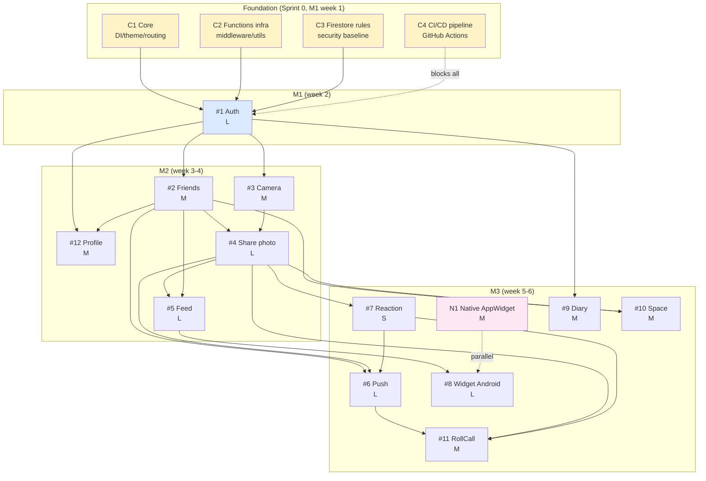

# Module Catalog — Meep

> Single source of truth cho **scope toàn bộ dự án** (17 modules). Tài liệu này dùng cho team kickoff + decision boundary trước khi đi sâu spec từng module.

| Status | Owner | Last update |
|---|---|---|
| 🟡 Outdated (đợi rewrite) | `ThienPDM` (Leader) | 2026-05-03 |

> ⚠️ **2026-05-21 — File này đang outdated sau ADR-0004.**
>
> - Trường `Lane: BE-heavy / UI-heavy + BE` không còn áp dụng — solo-dev model không tách FE/BE.
> - Pre-assignment "Owner: ThienPDM + KhoaLND (BE) + NganTNK + HanDHG (UI)" sẽ được rewrite theo nguyên tắc:
>   - **ThienPDM (Leader) + KhoaLND** → module phức tạp (Auth, Post + storage, Widget native, Cloud Functions infra). Mỗi người own nhiều module hơn.
>   - **HanDHG + NganTNK** → module M (medium) hoặc dễ. Ít module hơn (đổi thời gian Figma).
>   - 1 module = 1 owner duy nhất (không pair). Cross-module touch strict gate qua leader.
> - Anh (Leader) sẽ rewrite full file này trong sprint tới. Tới khi đó, KHÔNG dùng các trường `Lane` / `Owner` ở đây làm source of truth.
> - Source of truth hiện tại cho assignment: GitHub issue assignee + ADR-0004.

## 0. Quick navigation

- [§1 Module là gì trong Meep](#1-module-là-gì-trong-meep)
- [§2 Module categories overview](#2-module-categories-overview)
- [§3 Feature modules — Tier 0](#3-feature-modules--tier-0-locket-parity)
- [§4 Feature modules — Tier 0+](#4-feature-modules--tier-0-meep-differentiator)
- [§5 Cross-cutting modules (foundation)](#5-cross-cutting-modules-foundation)
- [§6 Native modules](#6-native-modules)
- [§7 Dependency graph](#7-dependency-graph)
- [§8 Assignment matrix](#8-assignment-matrix)
- [§9 Implementation order (sprint plan)](#9-implementation-order-sprint-plan)
- [§10 Out of scope (defer post-capstone)](#10-out-of-scope-defer-post-capstone)
- [§11 Open decisions](#11-open-decisions-per-module)

---

## 1. Module là gì trong Meep

**Module** = đơn vị code ownership + delivery, gắn 1-1 với 1 folder code path. Đây là khái niệm khác với **feature** (user-facing) và **epic** (GitHub tracking unit).

### Phân biệt

| Khái niệm | Tầm nhìn | Vd | Granularity | Owner |
|---|---|---|---|---|
| **Feature** | User-facing | "Đăng ký + đăng nhập" | 1-2 sentences | Product (Leader) |
| **Module** | Code/dev-facing | `apps/mobile/lib/features/auth/` | 1 folder | Primary dev (per CODEOWNERS) |
| **Epic Issue** | GitHub tracking | Issue #1 [T0] Auth | 1 GitHub issue | Assignee on issue |
| **Sub-issue / Task** | Sprint deliverable | "Tạo màn signup email step 1" | 1 PR ≤200 LOC | 1 dev |

**1 module thường = 1 feature = 1 Epic Issue**, ngoại trừ:
- Cross-cutting modules (C1-C4) không có Epic vì là foundation infra
- Native module N1 song song với Epic #8 (Flutter side)

### Lifecycle 1 module

```
catalog (modules.md, NOW)
   ↓
spec (/spec → docs/specs/YYYY-MM-DD-<module>.md)
   ↓
plan (/plan → tasks/todo-<module>.md, 8-12 sub-tasks)
   ↓
breakdown (sub-issues GitHub, 1 sub-issue = 1 PR ≤200 LOC)
   ↓
implement (4 phases workflow per Epic body)
   ↓
verify + close
```

---

## 2. Module categories overview

| Category | Count | Purpose | Has Epic? |
|---|---|---|---|
| **A. Feature modules — Tier 0** | 8 | Locket parity, must ship M3 | ✅ Yes (#1-8) |
| **B. Feature modules — Tier 0+** | 4 | Meep differentiator, must ship M3 | ✅ Yes (#9-12) |
| **C. Cross-cutting (foundation)** | 4 | Infra/baseline, blocks all features | ❌ No (consider Epic #14-17) |
| **D. Native modules** | 1 | Platform-specific Kotlin | ❌ Parallel với Epic #8 |
| **TOTAL** | **17** | | |

---

## 3. Feature modules — Tier 0 (Locket parity)

### 3.1 Auth — `apps/mobile/lib/features/auth/`

| Field | Value |
|---|---|
| **Epic** | #1 |
| **Tier / Milestone** | T0 / M1 |
| **Lane** | BE-heavy |
| **Owner** | `ThienPDM` (primary) + `KhoaLND` (secondary) |
| **Effort** | **L** (4-5 days, includes 5-screen signup flow + Google OAuth) |

**Purpose:** Foundation auth — signup 5-step flow, login email/Google, auto-login, logout, forgot password, email verification lazy.

**Scope summary:**
- **Signup 5 bước:** email + password → họ tên (display name) → username (@handle) → skip profile pic → skip contacts → vào Feed
- **Login:** email + password, Google OAuth (1-tap Android)
- **Auto-login:** Firebase Auth persistence (không session timeout, multi-device OK)
- **Logout**
- **Forgot password:** Firebase hosted reset page, link TTL **1 giờ**
- **Email verification:** lazy + banner (không block app), auto-send sau signup, escalation ladder (24h warning → 7d persistent banner), link TTL **72 giờ**, resend rate limit 1/phút
- **Deeplink:** handle reset link + verification link
- **Username:** unique, real-time validation, format `3-20 chars [a-z0-9_] lowercase`, cho đổi 1 lần / 30 ngày
- **Password policy:** min 8 chars, ≥1 uppercase + ≥1 số + ≥1 ký tự đặc biệt
- **Default avatar:** chữ cái đầu display name (không upload trong signup, edit trong Profile #12)
- **2 name fields:** display name (họ tên, step 2) + username (@handle, step 3)

**Out of scope (defer):** Apple Sign-In (post iOS), Phone OTP, Account deletion, 2FA, Email verification strict gate, Contact import screen (MVP skip — tương lai add giống FB).

**Depends on:** `C1 Core`, `C2 Functions infra`, `C3 Firestore rules`.

**Tech refs:**
- Firestore: `users` collection
- Cloud Functions: `validateUsername`
- Figma: `Đăng ký_*.png`, `Đăng nhập_*.png`
- Detail: [features.md §Auth](features.md), [Issue #1](https://github.com/manhthien2005/Meep/issues/1)

> 🔒 **Module LOCKED** — decisions chốt 2026-05-03. Xem chi tiết bên dưới.

<details>
<summary>📋 Decisions đã chốt (click mở)</summary>

| # | Decision | Chốt |
|---|---|---|
| 1 | Forgot password | ✅ IN scope, Firebase hosted, link TTL 1h |
| 2 | Email verification | ✅ Lazy + banner + auto-send + escalation (24h → 7d) |
| 3 | Username format | `3-20 chars, [a-z0-9_], lowercase` |
| 4 | Password policy | Min 8, ≥1 uppercase + ≥1 số + ≥1 ký tự đặc biệt |
| 5 | Default avatar | Chữ cái đầu display name (không upload trong signup) |
| 6 | Sau signup → đâu | Feed thẳng (MVP). Tương lai: contact import screen |
| 7 | Session timeout | Không (Firebase persistent) |
| 8 | Multi-device | OK |
| 9 | Display name vs Username | Cả 2: display name = họ tên, username = @handle |
| 10 | Username đổi sau signup | Cho đổi, 1 lần / 30 ngày |
| 11 | Profile pic edit | Trong Profile (#12), không trong signup |
| 12 | Verification link TTL | 72 giờ (Firebase default) |
| 13 | Reset password link TTL | 1 giờ |

</details>

---

### 3.2 Friends — `apps/mobile/lib/features/friend/`

| Field | Value |
|---|---|
| **Epic** | #2 |
| **Tier / Milestone** | T0 / M2 |
| **Lane** | BE-heavy |
| **Owner** | `ThienPDM` + `KhoaLND` |
| **Effort** | **M** (3-4 days) |

**Purpose:** Friend graph — invite username/link, accept/decline request, danh sách bạn, unfriend bidirectional.

**Scope summary:**
- **Tìm bạn:** username exact match (MVP), tương lai fuzzy + display name
- **Invite link:** `meep://{username}` — app installed → open profile, not installed → Play Store
- **Friend request flow:** gửi / accept / decline / cancel (sender cancel trước khi recipient respond)
- **Friend request duplicate:** A gửi B + B gửi A cùng lúc → auto-accept luôn
- **Friend request expiry:** 30 ngày tự huỷ (Cloud Function cron cleanup)
- **Friend list:** avatar + display name + username, search trong list, sort alphabetical theo display name
- **Unfriend:** bidirectional, dialog confirm, **không notify** khi bị unfriend
- **Data:** Cloud Functions handle write (client không write trực tiếp vào friendships)
- **Khi unfriend → giữ chat history** (nếu có Tier 1), chỉ xoá friend link

**Out of scope:** Friend suggestions, Public/follower model, Block user, Contact import, Mutual friends display, Friend limit (Tier 2).

**Depends on:** `Auth (#1)` (cần uid), `C2`, `C3`.

**Tech refs:**
- Firestore: `friend_requests`, `friendships` (pair ID `<min_uid>_<max_uid>` sorted)
- Cloud Functions: `sendFriendRequest`, `acceptFriendRequest`, `declineFriendRequest`, `cancelFriendRequest`
- Deeplink: `meep://{username}`
- Issue #2

> 🔒 **Module LOCKED** — decisions chốt 2026-05-03.

<details>
<summary>📋 Decisions đã chốt (click mở)</summary>

| # | Decision | Chốt |
|---|---|---|
| 1 | Pair ID format | `<min_uid>_<max_uid>` (sorted alphabetically) |
| 2 | Friend request expiry | 30 ngày tự huỷ (cron cleanup) |
| 3 | Cancel request | Cho phép sender cancel trước khi recipient respond |
| 4 | Unfriend confirmation | Dialog confirm |
| 5 | Search type | Username exact match (MVP) |
| 6 | Friend list sort | Alphabetical theo display name |
| 7 | Invite link format | `meep://{username}` (dùng username, không dùng uid) |
| 8 | Unfriend → chat history | Giữ history, chỉ xoá friend link |
| 9 | Unfriend notification | Không notify (tránh drama) |
| 10 | Duplicate request (A→B + B→A) | Auto-accept luôn |

</details>

---

### 3.3 Camera — `apps/mobile/lib/features/camera/`

| Field | Value |
|---|---|
| **Epic** | #3 |
| **Tier / Milestone** | T0 / M2 |
| **Lane** | UI-heavy + BE |
| **Owner** | `ThienPDM` (primary) + `NganTNK` + `HanDHG` (UI) + `KhoaLND` (video pipeline) |
| **Effort** | **XL** (7-9 days — photo + dual sequential + short video + caption templates) |

**Purpose:** Camera đầy đủ — photo 1:1 square, dual sequential capture (BeReal style), short video 5-10s, caption templates.

**Scope summary:**
- **Photo capture:** 1:1 square viewport (crop center), 720p, compress < 500KB JPEG ~80%
- **Dual sequential capture (BeReal style):** chụp camera sau → switch ~0.5-1s → chụp camera trước → combine main + PIP selfie
- **Short video:** 5-10s, H.264 720p, client compress (`video_compress`), resumable upload, thumbnail generate (Cloud Function)
- **Flip camera:** front/back toggle
- **Flash:** Auto / On / Off
- **Caption templates:** 3-5 preset styles (font + color + background), user chọn style → nhập text 200 chars → overlay lên ảnh
- **Gallery pick:** chọn ảnh từ gallery (`image_picker`), qua cùng compression pipeline
- **Preview trước gửi:** capture → preview + add caption → confirm gửi
- **Front camera:** un-mirror (preview mirror, ảnh lưu un-mirror — standard)
- **Permission denied:** dialog giải thích + nút mở Settings
- **Error handling:** toast + cho chụp/quay lại

**Out of scope:** True multi-camera API đồng thời (dùng sequential thay), filters/AR overlays, sticker system, video > 10s, custom font upload.

**Depends on:** `Auth (#1)`, `C1`, `C2` (Cloud Function thumbnail generate).

**Tech refs:**
- Plugins: `camera`, `video_compress`, `image_picker`, `path_provider`, `image`, `permission_handler`
- Cloud Function: `onVideoUploaded` → generate thumbnail
- Figma: `Trang chủ.png` (camera viewfinder)
- Issue #3

> 🔒 **Module LOCKED** — decisions chốt 2026-05-03.

<details>
<summary>📋 Decisions đã chốt (click mở)</summary>

| # | Decision | Chốt |
|---|---|---|
| 1 | Camera plugin | `camera` (official Flutter) |
| 2 | Format | 1:1 square (crop center) |
| 3 | Resolution + compress | 720p, < 500KB JPEG ~80% |
| 4 | Caption | 200 chars + 3-5 preset templates (styled) |
| 5 | Album picker destination | Feed only MVP, extend Space sau |
| 6 | Flash | Auto / On / Off toggle |
| 7 | Gallery pick | Có, cùng compression pipeline |
| 8 | Preview trước gửi | Có |
| 9 | Front camera | Un-mirror (standard) |
| 10 | Crop/edit | Không — chụp → preview → gửi |
| 11 | Dual camera | Sequential capture (BeReal style), không multi-cam API |
| 12 | Short video | 5-10s, H.264 720p, client compress, thumbnail Cloud Function |
| 13 | Video playback (Feed) | Auto-play muted, tap unmute |

</details>

---

### 3.4 Share photo — `apps/mobile/lib/features/post/`

| Field | Value |
|---|---|
| **Epic** | #4 |
| **Tier / Milestone** | T0 / M2 |
| **Lane** | BE-heavy |
| **Owner** | `ThienPDM` + `KhoaLND` |
| **Effort** | **L** (4-5 days, photo + video + dual upload + fan-out + delete + offline queue) |

**Purpose:** Nhận output từ Camera (#3) → upload Storage → lưu metadata Firestore → fan-out FCM cho friends. Handle photo, video, và dual.

**Scope summary:**
- **Upload photo:** compress JPEG → `posts/{uid}/{postId}/photo.jpg`, EXIF strip client-side
- **Upload video:** H.264 từ Camera → `posts/{uid}/{postId}/video.mp4`
- **Upload dual:** **2 file riêng** `main.jpg` + `selfie.jpg` (client render combined, tap swap main ↔ PIP trong feed)
- **Resumable upload** + progress indicator + retry 3 lần
- **Post metadata** Firestore `posts/{postId}`: authorId, type (`photo`/`video`/`dual`), caption (text metadata), timestamp, thumbnailUrl
- **Cloud Function `onPostCreated`:** fan-out FCM cho all friends (≤500 tokens/batch)
- **Cloud Function `onVideoUploaded`:** generate thumbnail từ video frame 0
- **Delete post:** cho phép author delete (soft delete flag, Cloud Function cleanup Storage)
- **Offline queue:** queue locally, auto-upload khi có mạng (`connectivity_plus`)
- **Caption:** text metadata hiển dưới post trong feed (không burn vào media)
- **Destination:** MVP = "All friends" only. Space extend sau (#10)
- **Upload size limit:** photo < 500KB, video < 10MB

**Out of scope:** Multi-image post, Edit post after share, Scheduled post, Draft save (Tier 2).

**Depends on:** `Camera (#3)`, `Friends (#2)`, `C2`, `C3`.

**Tech refs:**
- Firestore: `posts` collection
- Storage: `posts/{uid}/{postId}/{photo.jpg,selfie.jpg,video.mp4,thumbnail.jpg}`
- Cloud Functions: `onPostCreated` (fan-out), `onVideoUploaded` (thumbnail)
- Plugins: `connectivity_plus`
- Issue #4

> 🔒 **Module LOCKED** — decisions chốt 2026-05-03.

<details>
<summary>📋 Decisions đã chốt (click mở)</summary>

| # | Decision | Chốt |
|---|---|---|
| 1 | Dual photo storage | **2 file riêng** (main.jpg + selfie.jpg) + tap swap |
| 2 | Video thumbnail | Cloud Function extract frame 0 |
| 3 | Post type enum | `photo`, `video`, `dual` |
| 4 | Upload size limit | Photo < 500KB, Video < 10MB |
| 5 | Fan-out strategy | Cloud Function read friends → batch FCM ≤500/batch |
| 6 | Offline post | Queue locally, auto-upload khi có mạng |
| 7 | Delete post | Cho phép author delete (soft delete + cleanup) |
| 8 | Caption | Text metadata (không burn vào media) |

</details>

---

### 3.5 Feed — `apps/mobile/lib/features/feed/`

| Field | Value |
|---|---|
| **Epic** | #5 |
| **Tier / Milestone** | T0 / M2 |
| **Lane** | UI-heavy |
| **Owner** | `ThienPDM` + `NganTNK` + `HanDHG` |
| **Effort** | **L** (5-6 days, full-screen PageView + 3 post types + Space theme indicator + cache) |

**Purpose:** Full-screen swipe feed (Locket style) hiển thị posts từ friends + spaces.

**Scope summary:**
- **Layout:** Full-screen PageView (Locket style), swipe up/down = next/prev post, 1 post/lần
- **3 post types render:**
  - `photo` — cached image, tap fullscreen
  - `video` — auto-play khi lướt tới, muted, tap unmute
  - `dual` — main + PIP overlay, **tap swap** main ↔ selfie
- **Feed chung (mặc định):** all friends + all spaces trộn chronological. Post thuộc Space → **đổi theme color** (viền/badge màu Space) để nhận biết context
- **Feed per Space:** khi vào Space → chỉ thấy posts Space đó
- **Caption:** text metadata hiển dưới post
- **Author info:** avatar + display name + timestamp (tap → Profile #12)
- **Reaction count** hiển dưới post (tap → Reaction #7)
- **Reply:** nút reply → đi vào **inbox/chat** (không comment MXH). 1-1 → chat với author, Space post → group chat Space
- **Menu "...":** lưu ảnh về device (photo/dual), delete (author only)
- **Pagination:** load next batch khi gần hết page, `startAfter` cursor
- **Cache offline:** 20 bài mới nhất + images. Video chỉ cache thumbnail
- **Skeleton loader** khi loading
- **Empty state** khi chưa có bạn hoặc chưa có post
- **RollCall posts:** pin top 24h (khi #11 done)
- **Delete post:** author only, dialog confirm, soft delete

**Out of scope:** Algorithmic ranking (chronological only), Stories/ephemeral, Public feed, Comment thread kiểu MXH, Seen indicator, Post detail screen riêng.

**Depends on:** `Share photo (#4)`, `Friends (#2)`, `Chat (NEW)`, `C1`.

**Tech refs:**
- Flutter: `PageView` + `PageController` (full-screen swipe)
- Plugins: `cached_network_image`, `video_player`, `hive` (offline cache)
- Firestore pagination: `startAfter` cursor
- Issue #5

> 🔒 **Module LOCKED** — decisions chốt 2026-05-03.

<details>
<summary>📋 Decisions đã chốt (click mở)</summary>

| # | Decision | Chốt |
|---|---|---|
| 1 | Feed style | Full-screen PageView (Locket), swipe up/down |
| 2 | Video auto-play | Play khi lướt tới post, muted, tap unmute |
| 3 | Video cache | Thumbnail only, stream on-demand |
| 4 | Dual PIP | Góc trên phải, ~25%, rounded corner |
| 5 | Dual tap swap | Tap PIP → swap main ↔ selfie (animation) |
| 6 | Feed sort | Chronological DESC |
| 7 | Pagination | Load next batch khi gần hết page |
| 8 | Offline cache | 20 bài + images, video thumbnail only |
| 9 | RollCall priority | Pin top 24h |
| 10 | Delete | Author only, dialog confirm, soft delete |
| 11 | Seen indicator | Không (defer V2) |
| 12 | Save ảnh | Có, qua menu "..." (photo/dual only) |
| 13 | Reply/comment | Đi vào inbox/chat (không comment MXH) |
| 14 | Feed chung | All friends + spaces trộn chronological, Space post đổi theme color |
| 15 | Feed per Space | Vào Space → filter posts Space đó |

</details>

---

### 3.6 Push notification — `apps/mobile/lib/features/notification/`

| Field | Value |
|---|---|
| **Epic** | #6 |
| **Tier / Milestone** | T0 / M3 |
| **Lane** | BE-heavy |
| **Owner** | `ThienPDM` + `KhoaLND` |
| **Effort** | **L** (4-5 days, 7 events + 3 states + deeplink routing + custom sounds) |

**Purpose:** FCM Android cho 7 events (including chat) + deeplink routing khi tap.

**Scope summary:**
- **FCM token** register + refresh
- **7 events:**
  1. Friend request received
  2. Friend request accepted
  3. New post (friend/space)
  4. Reaction on your post
  5. RollCall reminder (cron)
  6. New chat message (1-1)
  7. New chat message (group/Space)
- **Deeplink routing:** tap notification → mở đúng screen
- **3 states:** foreground (in-app banner), background, terminated
- **3 Android channels:** `social` (friend/reaction/post), `chat` (messages — custom sound riêng), `rollcall`
- **Chat sound:** custom sound khác social (anh custom riêng)
- **Smart suppress:** không notify nếu đang trong đúng conversation đó
- **Badge count** (unread)

**Out of scope:** iOS APNs, notification preferences UI per type, email notification, notification grouping/bundling, DND/quiet hours (V2).

**Depends on:** `Auth (#1)`, `Friends (#2)`, `Share (#4)`, `Reaction (#7)`, `RollCall (#11)`, `Chat (NEW)`, `C2`.

**Tech refs:**
- Plugin: `firebase_messaging`
- Cloud Functions: per event type (Firestore trigger fan-out)
- Deeplink schema: `meep://<route>`
- Issue #6

> 🔒 **Module LOCKED** — decisions chốt 2026-05-03.

<details>
<summary>📋 Decisions đã chốt (click mở)</summary>

| # | Decision | Chốt |
|---|---|---|
| 1 | Notification channels | 3: `social`, `chat` (custom sound), `rollcall` |
| 2 | Chat sound | Custom riêng (anh design) |
| 3 | Group chat notify | Mỗi message 1 notify (bundle defer V2) |
| 4 | DND / quiet hours | Không MVP |
| 5 | In-chat suppress | Không notify khi đang trong đúng conversation |

</details>

---

### 3.7 Reaction — `apps/mobile/lib/features/reaction/`

| Field | Value |
|---|---|
| **Epic** | #7 |
| **Tier / Milestone** | T0 / M3 |
| **Lane** | UI-heavy |
| **Owner** | `ThienPDM` + `NganTNK` + `HanDHG` |
| **Effort** | **S** (1-2 days) |

**Purpose:** Emoji react per post + animation + count + push notify author.

**Scope summary:**
- **5 emoji:** ❤️😂😮😢😡
- **Regular post:** 1 emoji/user/post, tap lại → override
- **RollCall post:** **cumulative** (mỗi lần thả = 1 record, cộng dồn, nhiều emoji khác nhau)
- **Double-tap post:** = ❤️ shortcut (giống Instagram)
- **Undo react:** tap lại emoji đang active → remove
- **Animation:** emoji float animation khi react
- **Count display:** aggregated dưới post (emoji + số)
- **Notify author:** push event #4
- **React on video:** có — same flow như photo

**Out of scope:** Custom emoji upload, Reaction comments, Multi-emoji per user (chỉ RollCall).

**Depends on:** `Share photo (#4)`, `C2`.

**Tech refs:**
- Firestore subcollection: `posts/{postId}/reactions/{userId}`
- Cloud Function: `onReactionAdded` → notify author
- Issue #7

> 🔒 **Module LOCKED** — decisions chốt 2026-05-03.

<details>
<summary>📋 Decisions đã chốt (click mở)</summary>

| # | Decision | Chốt |
|---|---|---|
| 1 | Emoji set | ❤️😂😮😢😡 (5) |
| 2 | React per user/post | 1 emoji, tap lại override |
| 3 | Animation | Emoji float |
| 4 | Count display | Aggregated (emoji + số) |
| 5 | Notify author | Push event #4 |
| 6 | React on video | Có |
| 7 | RollCall multi-emoji | 5 đồng thời per user |
| 8 | Double-tap | = ❤️ shortcut |
| 9 | Undo react | Tap lại → remove |

</details>

---

### 3.8 Widget Android — `apps/mobile/lib/features/widget/` + Native (`apps/widget/`, see N1)

| Field | Value |
|---|---|
| **Epic** | #8 |
| **Tier / Milestone** | T0 / M3 |
| **Lane** | Native + UI |
| **Owner** | `ThienPDM` (only — native specialty) |
| **Effort** | **L** (5 days, Flutter side + Kotlin side) |

**Purpose:** Android home-screen widget hiển thị ảnh mới nhất từ friends/spaces, tap → mở app vào feed. Hybrid Flutter + Kotlin.

**Scope summary:**
- **Size:** 2x2 (MVP). V2 thêm 4x2
- **Content:** ảnh mới nhất từ Feed (photo/dual thumbnail, video thumbnail)
- **Space post:** hiện ảnh Space nếu là post mới nhất, **viền màu Space** để nhận biết
- **Update:** WorkManager 30 phút default, battery saver → 60 phút
- **Tap:** deeplink `meep://feed` → mở app vào feed
- **Cache:** Glide/Coil local cache (Kotlin side)
- **Offline:** hiện cached ảnh cuối cùng + "Offline" badge
- **Auth required:** widget blank + "Đăng nhập Meep" nếu chưa login
- **Multiple widgets:** MVP 1 instance = feed chung. V2 chọn Space per widget

**Out of scope:** iOS WidgetKit (defer per ADR-0002), Multiple widget sizes, Configurable widget settings, Per-Space widget.

**Depends on:** `Feed (#5)` (data source), `N1 Android AppWidget` (Kotlin native side).

**Tech refs:**
- Plugin: `home_widget` (Flutter ↔ Kotlin bridge)
- Native: AppWidgetProvider (Kotlin), WorkManager, Glide/Coil
- Issue #8

> 🔒 **Module LOCKED** — decisions chốt 2026-05-03.

<details>
<summary>📋 Decisions đã chốt (click mở)</summary>

| # | Decision | Chốt |
|---|---|---|
| 1 | Widget size | 2x2 MVP |
| 2 | Content | Ảnh mới nhất (photo/dual/video thumbnail) |
| 3 | Update frequency | 30 phút, battery saver 60 phút |
| 4 | Tap action | `meep://feed` |
| 5 | Image cache | Glide/Coil local |
| 6 | Offline | Cached ảnh cuối + "Offline" badge |
| 7 | Space post | Có, viền màu Space |
| 8 | Multiple widgets | 1 feed chung MVP |
| 9 | Auth required | Blank + "Đăng nhập Meep" |

</details>

---

## 4. Feature modules — Tier 0+ (Meep differentiator)

### 4.1 Diary — `apps/mobile/lib/features/diary/`

| Field | Value |
|---|---|
| **Epic** | #9 |
| **Tier / Milestone** | T0+ / M3 |
| **Lane** | UI-heavy |
| **Owner** | `ThienPDM` + `NganTNK` + `HanDHG` |
| **Effort** | **M** (3 days) |

**Purpose:** Diary basic — text entry + 1-3 ảnh đính kèm, PRIVATE only. KHÔNG canvas editor.

**Scope summary:**
- **Privacy:** default PRIVATE. **Toggle `isPublic`** khi tạo/edit (dialog confirm khi chuyển public)
- **Public entries:** hiện trên Profile Tab 2 cho bạn bè xem
- **Text:** 1000 chars, plain text
- **Attach ảnh:** 1-3 ảnh từ gallery hoặc camera, cùng compression pipeline
- **Layout:** grid view entries (thumbnail + date + preview text)
- **Detail view:** tap entry → full text + ảnh gallery
- **Edit:** cho edit text + thêm/xoá ảnh sau khi tạo
- **Delete:** dialog confirm
- **Sort:** mới nhất trên (chronological DESC)
- **Camera fallback:** chụp ảnh không chọn Space/Feed → option "Lưu vào Nhật ký"

**Out of scope:** Canvas drawing/editor, Stickers, Voice notes, Mood tracker, Encryption, Search diary, Share diary entry.

**Depends on:** `Auth (#1)` (private to user), `Camera (#3)` (optional capture).

**Tech refs:**
- Firestore: `diary_entries/{uid}/{entryId}` (private subcollection)
- Storage: `diary/{uid}/{entryId}/{filename}.jpg`
- Plugin: `image_picker`
- Figma: `Nhật ký.png`
- Issue #9

> 🔒 **Module LOCKED** — decisions chốt 2026-05-03.

<details>
<summary>📋 Decisions đã chốt (click mở)</summary>

| # | Decision | Chốt |
|---|---|---|
| 1 | Privacy | Default private, toggle `isPublic` (confirm dialog) |
| 2 | Text limit | 1000 chars, plain text |
| 3 | Attach ảnh | 1-3, cùng compression pipeline |
| 4 | Layout | Grid (thumbnail + date + preview) |
| 5 | Detail view | Full text + ảnh gallery |
| 6 | Delete | Dialog confirm |
| 7 | Edit | Cho edit text + ảnh |
| 8 | Sort | Chronological DESC |
| 9 | Search | Không MVP |
| 10 | Camera fallback | Option "Lưu vào Nhật ký" |

</details>

---

### 4.2 Space — `apps/mobile/lib/features/space/`

| Field | Value |
|---|---|
| **Epic** | #10 |
| **Tier / Milestone** | T0+ / M3 |
| **Lane** | BE-heavy + UI |
| **Owner** | `ThienPDM` + `KhoaLND` (BE) + `NganTNK` + `HanDHG` (UI theme) |
| **Effort** | **L** (5-6 days — context switch + group chat + broadcasting + theme) |

**Purpose:** Không gian & Kết nối — cá nhân hoá trải nghiệm chia sẻ ảnh theo nhóm (Space). Context switch trên Camera + Group Chat đính kèm.

**Scope summary:**

**Space management:**
- Tạo Space (name + icon preset + color HEX chủ đạo)
- Invite members từ friend list (max 10 MVP)
- Leave Space
- Delete Space (creator only, dialog confirm, soft delete)
- Kick member (creator only)
- Only invited (không search/discover)

**Context Switch (FR1) — Camera integration:**
- Long-press nút "Tổng bạn bè" → hiện danh sách Space (bottom sheet)
- Chọn Space → Camera UI đổi theme (viền, nút chụp, text đổi color HEX + icon Space)
- Visual rõ ràng user đang gửi cho ai

**Content Broadcasting (FR2):**
- Chụp trong Space → gửi → auto-broadcast cho tất cả members (không chọn thủ công)
- Post metadata có `spaceId`

**Group Chat Integration (FR3):**
- Reply ảnh trong Space → mở Group Chat Space
- Quote mechanism: tin nhắn kèm thumbnail 200x200 + caption gốc
- Real-time sync cho tất cả members
- Group Chat nằm trong khu vực Chat/Inbox chung

**Business Rules:**
- BR1: Camera mặc định không chọn Space → chọn Space trước khi gửi, hoặc → "Lưu vào Nhật ký"
- BR2: Data isolation — Space A ≠ Space B
- BR3: Thumbnail chat 200x200 nén tối ưu

**Out of scope:** Public space discovery, Admin role hierarchy, Space settings phức tạp, Custom icon upload, Custom hex input (chỉ preset).

**Depends on:** `Friends (#2)` (invite source), `Share photo (#4)` (extend destination), `Camera (#3)` (context switch UI), `Chat (NEW)` (group chat).

**Tech refs:**
- Firestore: `spaces/{spaceId}` (name, icon, colorHex, creatorId) + `space_members/{spaceId}/{uid}`
- Cloud Function: `fanoutToSpace`, `onSpacePostCreated`
- Issue #10

> 🔒 **Module LOCKED** — decisions chốt 2026-05-03.

<details>
<summary>📋 Decisions đã chốt (click mở)</summary>

| # | Decision | Chốt |
|---|---|---|
| 1 | Max members | 10 MVP |
| 2 | Space deletion | Creator only, soft delete |
| 3 | Theme presets | 5-8 color + icon presets (không custom hex input) |
| 4 | Space icon | Preset icon set (không upload custom) |
| 5 | Member remove | Creator có thể kick |
| 6 | Feed per Space | Vào Space → feed chỉ posts Space đó |
| 7 | Space list UI | Bottom sheet khi long-press |

</details>

---

### 4.3 RollCall — `apps/mobile/lib/features/rollcall/`

| Field | Value |
|---|---|
| **Epic** | #11 |
| **Tier / Milestone** | T0+ / M3 |
| **Lane** | BE-heavy + UI |
| **Owner** | `ThienPDM` + `KhoaLND` (BE) + `NganTNK` + `HanDHG` (UI) |
| **Effort** | **L** (6 days — gallery picker + feed gating + 168h archive + cumulative react) |

**Purpose:** "Kết nối tập thể" — tuần 1 lần, chia sẻ khoảnh khắc đáng nhớ qua ảnh gallery, phải post mới được xem feed bạn bè.

**Scope summary:**

**Trigger + Access:**
- **Schedule:** Fixed Friday 8h GMT+7 (MVP). V2 user-configure
- **2 phương thức vào:** Push notification deeplink HOẶC icon RollCall góc trên trái màn hình chính
- **Push target:** All active users (≥1 friend)

**Content Creation (FR1):**
- **Gallery picker 7 ngày:** tự động lọc ảnh có `dateCreated` trong 7 ngày gần nhất
- **Không caption** — chỉ ảnh, tập trung trải nghiệm thị giác
- **Đăng nhanh:** chọn ảnh → nhấn Đăng (không preview/edit)
- Post tagged `rollcall: true`

**Feed Gating (FR2):**
- **Phải post trước mới xem:** check `hasPostedRollcall` flag
- Chưa post → màn hình chặn (blur/placeholder + nút kêu gọi đăng ảnh)
- Đã post → mở feed RollCall bạn bè

**Cumulative Reaction (FR3):**
- Mỗi lần thả emoji = 1 record riêng, cộng dồn
- Cho phép nhiều emoji khác nhau trên cùng 1 post (không giới hạn 5)
- **UI cố định:** nút emoji góc phải dưới, emoji hiển thị góc trái dưới

**168h Archive (BR4):**
- Post tồn tại 168h (7 ngày) trên feed
- Sau 168h → ẩn khỏi feed → **tự động chuyển vào Diary (private)**
- Cloud Function cron cleanup

**Out of scope:** Custom schedule per user, Video RollCall, Multi-photo per RollCall (chỉ 1 ảnh), Caption.

**Depends on:** `Camera (#3)` (gallery picker reuse), `Feed (#5)`, `Reaction (#7)` (extend cumulative model), `Push (#6)`, `Diary (#9)` (archive target), `C2`.

**Tech refs:**
- Cloud Functions: `scheduleRollCall` (Cloud Scheduler → Pub/Sub), `archiveRollCall` (cron 168h)
- Firestore: `posts` with `rollcall: true`, `rollcallCycle` field
- Plugin: `photo_manager` (gallery access + date filter)
- Issue #11

> 🔒 **Module LOCKED** — decisions chốt 2026-05-03.

<details>
<summary>📋 Decisions đã chốt (click mở)</summary>

| # | Decision | Chốt |
|---|---|---|
| 1 | Schedule | Fixed Friday 8h GMT+7 |
| 2 | Photo source | Gallery picker, lọc 7 ngày |
| 3 | Caption | Không — chỉ ảnh |
| 4 | Feed gating | Phải post trước mới xem |
| 5 | 168h archive | Ẩn → chuyển vào Diary (private) |
| 6 | Reaction model | Cumulative (mỗi thả = 1 record, cộng dồn) |
| 7 | UI positions | Button góc phải dưới, emoji góc trái dưới |
| 8 | Bắt buộc post? | Không, nhưng không post = không xem |
| 9 | Badge | Special tag trên post |

</details>

---

### 4.4 Profile — `apps/mobile/lib/features/profile/`

| Field | Value |
|---|---|
| **Epic** | #12 |
| **Tier / Milestone** | T0+ / M2 |
| **Lane** | UI-heavy |
| **Owner** | `ThienPDM` + `NganTNK` + `HanDHG` |
| **Effort** | **M** (3 days) |

**Purpose:** Profile screen — avatar, stats, bio, 2-tab content (posts + diary public). Own (editable) + others (read-only).

**Scope summary:**

**Header:**
- **Avatar:** circle, upload + crop 1:1 (`image_cropper`)
- **Stats row:** Bài viết (count) | Người bạn (count) | Space (count)
- **Username + Bio** (plain text, 100 chars)
- **Own profile:** nút "Chỉnh sửa" (edit avatar, display name, bio) + nút "Chia sẻ trang cá nhân" (copy deeplink `meep://{username}`)
- **Others' profile:** nút Add Friend / Pending / Unfriend

**2 Tabs content:**
- **Tab 1 (Grid posts):** 3 columns, rounded corners, tap → Feed fullscreen tại post đó, pagination
- **Tab 2 (Diary public):** Diary entries có `isPublic: true` của profile owner, grid layout (thumbnail + date)

**Username edit:** 1 lần/30 ngày (đã lock Auth #1)

**Out of scope:** Profile cover photo, Verified badges, Profile themes, Follower count (no follow model), Tagged photos tab.

**Depends on:** `Auth (#1)`, `Share photo (#4)` (posts grid), `Diary (#9)` (public entries), `Friends (#2)` (friend count + add/unfriend), `Space (#10)` (space count).

**Tech refs:**
- Firestore: `users/{uid}` (public fields) + `users/{uid}/private/*` (owner-only)
- Storage: `avatars/{uid}.jpg`
- Plugin: `image_cropper`
- Figma: `Trang Profile.png`
- Issue #12

> 🔒 **Module LOCKED** — decisions chốt 2026-05-03.

<details>
<summary>📋 Decisions đã chốt (click mở)</summary>

| # | Decision | Chốt |
|---|---|---|
| 1 | Bio | Plain text, 100 chars |
| 2 | Avatar | Upload + crop 1:1 |
| 3 | Stats row | Bài viết + Người bạn + Space (counts) |
| 4 | Share profile | Copy deeplink `meep://{username}` |
| 5 | Edit | Avatar + display name + bio |
| 6 | Add friend | Button trên others' profile |
| 7 | Tab 1 | Grid posts 3 columns |
| 8 | Tab 2 | Diary public (isPublic entries) |
| 9 | Username edit | 1 lần/30 ngày |

</details>

---

### 4.5 Chat (Inbox) — `apps/mobile/lib/features/chat/`

| Field | Value |
|---|---|
| **Epic** | #14 |
| **Tier / Milestone** | T0 / M2-M3 (infra 1-1 M2, group chat M3 cùng Space) |
| **Lane** | BE-heavy + UI |
| **Owner** | `ThienPDM` + `KhoaLND` (BE) + `NganTNK` + `HanDHG` (UI) |
| **Effort** | **L** (5-6 days — inbox + 1-1 photo-anchored + group Space chat) |

**Purpose:** Inbox tin nhắn (giống Locket) — 1-1 photo-anchored + group chat Space. Reply post → chat.

**Scope summary:**

**Inbox (conversation list):**
- List tất cả conversations (1-1 + group Space), sort by last message time
- Mỗi item: avatar + name + date + preview text + chevron
- Group Space chat: hiện **icon Space + color** thay avatar
- **Unread badge** per conversation + total badge trên bottom nav
- Pull-to-refresh

**1-1 Chat (photo-anchored):**
- Reply post trong Feed → mở thread với author
- **Quote mechanism:** tin nhắn kèm thumbnail ảnh gốc + caption
- Text messages only MVP (max 500 chars)
- Real-time (Firestore snapshots)
- Tạo chat: chỉ qua reply post hoặc tap "Nhắn tin" trên profile bạn

**Group Chat (Space):**
- Mỗi Space = 1 group chat thread
- Reply post Space → vào group chat Space
- Quote mechanism tương tự 1-1 (thumbnail 200x200 + caption)
- All Space members tham gia

**Message features:**
- Text only (max 500 chars)
- Timestamp per message
- Auto-scroll to bottom
- Load older messages: 30/page, scroll up
- Offline cache: last 20 conversations + 30 messages mỗi cái
- Delete conversation: ẩn khỏi list (không xoá data). Group chat không xoá được

**Out of scope:** Typing indicator, read receipts, image/video in chat, message edit/delete, search messages, voice message, message reactions, block user (V2).

**Depends on:** `Auth (#1)`, `Feed (#5)` (reply trigger), `Space (#10)` (group chat), `Push (#6)` (events #6, #7), `Friends (#2)`.

**Tech refs:**
- Firestore: `conversations/{convId}` + `conversations/{convId}/messages/{msgId}`
- Real-time: Firestore snapshots
- Figma: `Tin nhắn.png`
- Issue #14

> 🔒 **Module LOCKED** — decisions chốt 2026-05-03.

<details>
<summary>📋 Decisions đã chốt (click mở)</summary>

| # | Decision | Chốt |
|---|---|---|
| 1 | Tạo chat | Chỉ qua reply post hoặc tap "Nhắn tin" trên profile |
| 2 | Message limit | 500 chars text |
| 3 | Pagination | 30 messages/page, scroll up |
| 4 | Offline cache | 20 conversations + 30 messages |
| 5 | Delete conversation | Ẩn khỏi list, group không xoá |
| 6 | Block user | Không MVP |
| 7 | Notification | Events #6 (1-1) + #7 (group) |
| 8 | Epic | #14 |
| 9 | Milestone | M2 (1-1) + M3 (group) |

</details>

---

## 5. Cross-cutting modules (foundation)

> Cross-cutting = không thuộc feature cụ thể, nhưng **block tất cả feature modules**. Phải làm trước Auth (#1) trong Sprint 0 / M1 đầu.

### 5.1 C1. Core — `apps/mobile/lib/core/`

| Field | Value |
|---|---|
| **Epic** | None (cross-cutting, no epic) |
| **Tier / Milestone** | Foundation / M1 (Sprint 0, week 1) |
| **Lane** | Architecture |
| **Owner** | `ThienPDM` (only) |
| **Effort** | **M** (2-3 days) |

**Purpose:** DI, theme, routing, error handling, shared widgets — backbone của Flutter app.

**Scope summary:**
- DI: ProviderScope root, Riverpod 2 + code-gen wiring
- Theme: Material 3 light + dark, Meep brand colors (per Figma)
- Routing: GoRouter setup, route guards (auth-required), deeplink handler
- Error: `AppError` sealed hierarchy (NetworkError, ValidationError, etc.)
- Shared widgets: `MeepButton`, `MeepTextField`, `LoadingOverlay`, `ErrorBanner`

**Out of scope:** Internationalization (i18n) — defer (Vietnamese only MVP), Custom font system (use system).

**Blocks:** ALL feature modules (#1-12).

**Tech refs:**
- Files: `lib/core/{di,theme,routing,error,widgets}/`
- Already partial in `lib/core/theme/` + `lib/core/error/`
- Reference: `.windsurf/rules/21-flutter-rules.md` + `24-flutter-ui-patterns.md`

---

### 5.2 C2. Cloud Functions infra — `firebase/functions/src/`

| Field | Value |
|---|---|
| **Epic** | None (consider Epic #14) |
| **Tier / Milestone** | Foundation / M1 (Sprint 0) |
| **Lane** | BE-heavy |
| **Owner** | `ThienPDM` + `KhoaLND` |
| **Effort** | **S-M** (2 days) |

**Purpose:** Shared utils, middleware, auth check helpers, deployment scripts cho Cloud Functions.

**Scope summary:**
- Entry: `index.ts` cấu trúc export per feature
- Middleware: auth check, rate limit, request validation
- Shared utils: Firestore admin client, FCM admin client, logger
- Vitest test infra + emulator integration
- ESLint + tsconfig strict
- Deployment script: `firebase deploy --only functions`

**Out of scope:** Custom HTTP API server (Express in `services/api/`) — chỉ tạo nếu cần (per ADR-0001).

**Blocks:** Auth (#1), Friends (#2), Share (#4), Push (#6), Reaction (#7), Space (#10), RollCall (#11), Chat (#14).

**Tech refs:**
- Files: `firebase/functions/src/{shared,middleware,utils}/`
- Reference: `.windsurf/rules/22-functions-rules.md`

---

### 5.3 C3. Firestore rules + indexes — `firebase/firestore.rules`, `firebase/firestore.indexes.json`, `firebase/storage.rules`

| Field | Value |
|---|---|
| **Epic** | None (consider Epic #15) |
| **Tier / Milestone** | Foundation + incremental per feature |
| **Lane** | Security |
| **Owner** | `ThienPDM` (only — security-sensitive) |
| **Effort** | **M** total (incremental, ~1 day baseline + 0.5 day per feature) |

**Purpose:** Security baseline default-deny + per-collection helpers + Storage rules.

**Scope summary:**
- Helpers: `isAuthed()`, `isOwner(uid)`, `isFriend(uid)`, `isSpaceMember(spaceId)`
- Default deny everything
- Per-collection rules: `users`, `friend_requests`, `friendships`, `posts`, `reactions`, `diary_entries`, `spaces`, `space_members`, `conversations`
- Storage rules: 10MB cap, image MIME only, owner write paths
- Indexes: composite cho pagination queries
- Rules tests: `firebase emulators:exec --only firestore "npm run test:rules"`

**Out of scope:** Multi-tenant rules (single project), Custom claims complex hierarchies.

**Blocks:** Tất cả features đụng Firestore/Storage (gần như mọi #1-12).

**Tech refs:**
- Reference: `.windsurf/rules/23-firestore-rules.md`, `40-security-guardrails.md`
- Architecture: [security-model.md](../architecture/security-model.md)

---

### 5.4 C4. CI/CD pipeline — `.github/workflows/`

| Field | Value |
|---|---|
| **Epic** | None (consider Epic #16) |
| **Tier / Milestone** | Foundation / M1 (Sprint 0) |
| **Lane** | DevOps |
| **Owner** | `ThienPDM` (only) |
| **Effort** | **S** (1-2 days) |

**Purpose:** Auto lint + test + build trên PR, auto deploy on merge develop/deploy.

**Scope summary:**
- `pr-check.yml`: branch name validate, commitlint, flutter analyze + test, functions lint + test
- `develop-staging.yml`: build APK + Firebase App Distribution staging
- `deploy-production.yml`: manual approval gate + production deploy + tag release
- Husky hooks (already done): pre-commit format/lint, commit-msg commitlint, pre-push branch validate

**Out of scope:** Multi-environment beyond staging/production (no QA/UAT layer), Slack notification integration (manual coordination).

**Blocks:** Team velocity (every PR runs CI; broken CI = team blocked).

**Tech refs:**
- Files: `.github/workflows/*.yml` (already exist, may need refinement)
- Reference: `docs/team-workflow.md` §CI/CD

---

## 6. Native modules

### 6.1 N1. Android AppWidget — `apps/widget/`

| Field | Value |
|---|---|
| **Epic** | Parallel với #8 |
| **Tier / Milestone** | T0 / M3 |
| **Lane** | Native |
| **Owner** | `ThienPDM` (only — Kotlin specialty) |
| **Effort** | **M** (2-3 days, parallel với Flutter side) |

**Purpose:** Native Kotlin code cho Android home-screen widget. Receive ảnh URL từ Flutter qua `home_widget` plugin, render lên home screen.

**Scope summary:**
- `WidgetProvider` (extends AppWidgetProvider): lifecycle onUpdate, onEnabled, onDisabled
- `ImageLoader`: download URL → bitmap với Glide/Coil cache
- `UpdateWorker` (WorkManager): periodic 30 phút default, battery saver 60 phút
- Tap intent → launch Flutter activity với deeplink `meep://feed`
- Notification channels Android 8+
- Battery saver awareness

**Out of scope:** iOS WidgetKit (defer per ADR-0002), Multiple widget sizes, Configurable widget settings UI.

**Depends on:** `Feed (#5)` data source, `Push (#6)` deeplink schema.

**Parallel with:** Epic #8 (Flutter side trong `lib/features/widget/`).

**Tech refs:**
- Folder structure: `apps/widget/android/src/main/{kotlin,res}/`
- AndroidManifest.xml: receiver declaration
- Reference: ADR-0002 Android-first

---

## 7. Dependency graph



**Đọc graph:**
- 🟡 **Vàng** = Foundation (làm trước, block tất cả)
- 🔵 **Xanh dương** = Auth (block phần lớn features)
- 🌸 **Hồng** = Native (parallel)
- **Mũi tên đặc** = blocking dependency (phải xong A trước khi B start)
- **Mũi tên nét đứt** = parallel hoặc soft dependency

---

## 8. Assignment matrix

| ID | Module | Owner (primary) | Secondary | Lane | Effort | Tier | Milestone | Epic |
|---|---|---|---|---|---|---|---|---|
| **C1** | Core | `ThienPDM` | — | Architecture | M | Foundation | M1 | — |
| **C2** | Cloud Functions infra | `ThienPDM` | `KhoaLND` | BE | S-M | Foundation | M1 | — |
| **C3** | Firestore rules + indexes | `ThienPDM` | — | Security | M (incremental) | Foundation | M1+ | — |
| **C4** | CI/CD pipeline | `ThienPDM` | — | DevOps | S | Foundation | M1 | — |
| **#1** | Auth | `ThienPDM` | `KhoaLND` | BE | L | T0 | M1 | #1 |
| **#2** | Friends | `ThienPDM` | `KhoaLND` | BE | M | T0 | M2 | #2 |
| **#3** | Camera | `ThienPDM` | `NganTNK` + `HanDHG` | UI | M | T0 | M2 | #3 |
| **#4** | Share photo | `ThienPDM` | `KhoaLND` | BE | L | T0 | M2 | #4 |
| **#5** | Feed | `ThienPDM` | `NganTNK` + `HanDHG` | UI | L | T0 | M2 | #5 |
| **#6** | Push notification | `ThienPDM` | `KhoaLND` | BE | L | T0 | M3 | #6 |
| **#7** | Reaction | `ThienPDM` | `NganTNK` + `HanDHG` | UI | S | T0 | M3 | #7 |
| **#8** | Widget Android (Flutter side) | `ThienPDM` | — | Native+UI | L | T0 | M3 | #8 |
| **N1** | Android AppWidget (Kotlin) | `ThienPDM` | — | Native | M | T0 | M3 | parallel #8 |
| **#9** | Diary | `ThienPDM` | `NganTNK` + `HanDHG` | UI | M | T0+ | M3 | #9 |
| **#10** | Space | `ThienPDM` | `KhoaLND` | BE | M | T0+ | M3 | #10 |
| **#11** | RollCall | `ThienPDM` | `KhoaLND` | BE | M | T0+ | M3 | #11 |
| **#12** | Profile | `ThienPDM` | `NganTNK` + `HanDHG` | UI | M | T0+ | M2 | #12 |

### Workload distribution

| Dev | Modules primary | Modules secondary | Total effort weight |
|---|---|---|---|
| `ThienPDM` (Leader) | All 17 (default reviewer + critical path) | — | XXL (full-stack overhead) |
| `KhoaLND` (Open BE/UI) | — | C2, #1, #2, #4, #6, #10, #11 (7 BE modules) | L+ |
| `NganTNK` (UI) | — | #3, #5, #7, #9, #12 (5 UI modules) | M+ |
| `HanDHG` (UI) | — | #3, #5, #7, #9, #12 (5 UI modules) — same as Ngân | M+ |

> **Ngân + Hân share UI lane** — task assignment per sub-issue trong Project #2 (1 sub-issue = 1 dev). 2 UI devs cho phép parallelize multiple feature UI cùng lúc.

---

## 9. Implementation order (sprint plan)

> Mapping module → sprint week. Mỗi sprint = 1 tuần. Tổng 6 tuần (30/4 → 9/6/2026).

### Sprint 0 — Foundation (week 1, 30/4 — 6/5)

**Mục tiêu:** Setup infra trước Auth. CI green, Firestore rules baseline, Core skeleton.

- [x] **Phase 0.5 (DONE):** Repo + GitHub Project + Milestones + Epic issues + CODEOWNERS + branch protection
- [ ] `C4 CI/CD` — đảm bảo PR check work end-to-end (test sample PR)
- [ ] `C1 Core` — DI ProviderScope, theme, routing GoRouter, error sealed, shared widgets baseline
- [ ] `C2 Cloud Functions infra` — index.ts, middleware, vitest infra
- [ ] `C3 Firestore rules baseline` — helpers + default deny

**Owner:** `ThienPDM` (leader-only foundation work).

### Sprint 1 — Auth (week 2, 7/5 — 13/5) — **M1 due 13/5**

- [ ] **#1 Auth** — Epic full implementation (signup 5-screen, login, Google, auto-login, logout)
- [ ] `C3` — incremental rules cho `/users/{uid}`

**Pair:** `ThienPDM` (BE + Cloud Function `validateUsername`) + `KhoaLND` (Flutter UI screens).

**Demo M1:** 4 dev signup được, login lại được, auto-login work.

### Sprint 2 — Social Core part 1 (week 3, 14/5 — 20/5)

- [ ] **#2 Friends** — invite, accept, list, unfriend
- [ ] **#3 Camera** — capture, flip, caption
- [ ] **#12 Profile** — avatar, username edit, bio, grid (skeleton, posts grid empty until #4 done)

**Parallel:** Friends (BE pair) + Camera (UI pair) + Profile (UI pair) — 3 modules cùng lúc.

### Sprint 3 — Social Core part 2 (week 4, 21/5 — 27/5) — **M2 due 27/5**

- [ ] **#4 Share photo** — upload + Cloud Function fan-out
- [ ] **#5 Feed** — vertical list + cache + pagination
- [ ] **#12 Profile** — finalize posts grid (now #4 has data)

**Demo M2:** Team test signup → friend nhau → chụp ảnh → share → thấy trên feed.

### Sprint 4 — Differentiator part 1 (week 5, 28/5 — 3/6)

- [ ] **#6 Push notification** — FCM 5 events
- [ ] **#7 Reaction** — emoji + animation + count
- [ ] **#8 Widget Android (Flutter side)** + **N1 Native AppWidget** — parallel (cùng leader)

**Owner:** ThienPDM (Push + Widget native), KhoaLND (Push BE pair), Ngân + Hân (Reaction + Widget UI).

### Sprint 5 — Differentiator part 2 (week 6, 4/6 — 9/6) — **M3 due 9/6, DEMO DAY**

- [ ] **#9 Diary** — text + 1-3 ảnh attach
- [ ] **#10 Space** — nhóm + share photo to space
- [ ] **#11 RollCall** — cron + multi-emoji + push
- [ ] **Integration test E2E** — demo script `docs/roadmap/demo-script.md`
- [ ] **Demo dress rehearsal** — 8/6 trước demo day 9/6

**Demo M3 = Final demo:** Per `docs/roadmap/demo-script.md` (3 personas Aldo/Beatrice/Charlie story).

### Buffer + risk management

- **Sprint 5 = high-risk:** 3 features + integration test trong 1 tuần. Nếu velocity drop → cut RollCall (#11) → fallback Tier 1 stretch nào đó.
- **Reference:** [docs/roadmap/risks.md](../roadmap/risks.md), `mvp-tier-priority` memory.

---

## 10. Out of scope (defer post-capstone)

Không thuộc 17 modules trên. Cố ý cắt khỏi MVP — defer post-capstone để focus deliverable.

| Defer item | Lý do cắt | Khi cần xem lại |
|---|---|---|
| **iOS targeting** (Swift, WidgetKit, Apple Sign-In) | Velocity + complexity, ADR-0002 | Post-MVP, Q3 2026 |
| **Diary canvas editor** (drawing/stickers) | Quá phức tạp, không phải MVP value | V2 |
| **Group chat** trong Space | Cần real-time infra, full chat UI | V2 |
| **Theme switch per Space** | Polish, không essential | V2 |
| **RollCall 168h archive + feed gating** | Logic phức tạp, MVP simpler version OK | V2 |
| **Block/report user** (moderation) | Cần admin tooling | Post-launch |
| **Account deletion** (GDPR cascade) | Compliance level deferred | Pre-launch (compliance check) |
| **Public posts/follow model** | Out of Meep philosophy (intimate) | NEVER — anti-pattern |
| **Stories/ephemeral content** | Confusing với Locket parity scope | NEVER MVP |
| **Multi-image post** | Single image is Locket parity | V2 |
| **Video posts/recording** | Storage cost + complexity | V2 |
| **Voice notes / Audio Diary** | Out of scope | V3 |
| **i18n (multi-language)** | Vietnamese-only MVP | V2 (English first) |
| **Crashlytics custom dashboards** | Default Firebase OK | Post-launch |

> **Reference:** Tier 2 trong [features.md](features.md), AGENTS.md §Non-goals MVP.

---

## 11. Open decisions per module

> Câu hỏi chưa resolved cần discuss trong sprint planning hoặc kickoff. Track ở đây để không quên.

### Auth (#1) — 🔒 LOCKED 2026-05-03
- ✅ **Forgot password flow** — IN scope MVP (Firebase hosted reset, link TTL 1h)
- ✅ **Email verification gate** — Lazy + banner + auto-send + escalation (không block app)
- ✅ **Password policy** — Min 8, ≥1 uppercase + ≥1 số + ≥1 ký tự đặc biệt
- ✅ **Username format** — `3-20 chars [a-z0-9_] lowercase`, đổi 1x/30d
- ✅ **Default avatar** — Chữ cái đầu display name
- ✅ **Post-signup destination** — Feed thẳng (MVP), tương lai contact import
- ✅ **Session/multi-device** — Không timeout, multi-device OK

### Friends (#2) — 🔒 LOCKED 2026-05-03
- ✅ **Pair ID format** — `<min_uid>_<max_uid>` sorted alphabetically
- ✅ **Friend request expiry** — 30 ngày tự huỷ (cron cleanup)
- ✅ **Cancel request** — Cho phép sender cancel
- ✅ **Unfriend** — Dialog confirm, không notify, giữ chat history
- ✅ **Search** — Username exact match MVP
- ✅ **Invite link** — `meep://{username}` (dùng username)
- ✅ **Duplicate request** — Auto-accept

### Camera (#3) — 🔒 LOCKED 2026-05-03
- ✅ **Scope** — Option C: photo + dual sequential (BeReal) + short video 5-10s + caption templates
- ✅ **Format** — 1:1 square, 720p, < 500KB
- ✅ **Album picker** — Feed only MVP, extend Space sau
- ✅ **Front camera** — Un-mirror
- ✅ **Effort** — XL (7-9d) — ⚠️ risk M2 timeline, anh chấp nhận

### Push (#6)
- ❓ **Notification grouping** — bundle 5 reactions cùng post thành 1 notify? → V2, MVP gửi từng cái

### Widget (#8) + N1 — 🔒 LOCKED 2026-05-03
- ✅ **Update frequency** — 30 phút default, battery saver 60 phút
- ✅ **Space post** — Hiện ảnh Space với viền màu, 1 feed chung MVP
- ✅ **Auth** — Blank + "Đăng nhập Meep" khi chưa login

### Diary (#9) — 🔒 LOCKED 2026-05-03
- ✅ **Privacy** — PRIVATE only
- ✅ **Edit** — Cho edit text + ảnh sau tạo
- ✅ **Camera fallback** — Option "Lưu vào Nhật ký"

### Space (#10) — 🔒 LOCKED 2026-05-03
- ✅ **Scope expanded** — Context switch + group chat + broadcasting + theme presets
- ✅ **Discovery** — Only invited
- ✅ **Deletion** — Creator only, soft delete
- ✅ **Max members** — 10 MVP
- ✅ **Theme** — 5-8 color + icon presets
- ✅ **Effort** — L (5-6d) — tăng từ M do scope expand

### RollCall (#11) — 🔒 LOCKED 2026-05-03
- ✅ **Full spec** — Gallery picker 7d + feed gating + 168h archive → Diary + cumulative react
- ✅ **Schedule** — Friday 8h GMT+7
- ✅ **No caption** — Chỉ ảnh
- ✅ **Effort** — L (6d) — tăng từ M do full spec

### Profile (#12) — 🔒 LOCKED 2026-05-03
- ✅ **Bio** — Plain text, 100 chars
- ✅ **Stats** — Bài viết + Người bạn + Space (counts)
- ✅ **Share** — Copy deeplink `meep://{username}`
- ✅ **2 tabs** — Posts grid + Diary public
- ✅ **Diary isPublic** — Cần update Diary module thêm toggle

---

## 12. Maintenance

- **Update khi:** scope change, new dependency, ownership change, milestone shift
- **Owner:** `ThienPDM` (leader)
- **Sync với:** [features.md](features.md) (when tier change), [milestones.md](../roadmap/milestones.md) (when sprint shift), `AGENTS.md` §Core MVP scope (when overall scope change)
- **Review cadence:** Mỗi cuối sprint (retro), update progress + open questions

---

📍 [Features catalog (user-facing)](features.md) · [Architecture overview](../architecture/system-overview.md) · [Milestones roadmap](../roadmap/milestones.md) · [Risks register](../roadmap/risks.md) · [Team workflow](../team-workflow.md)
